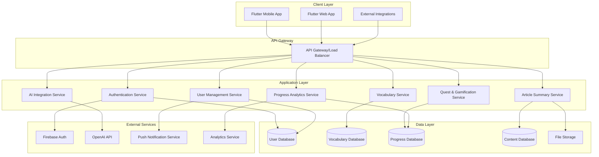
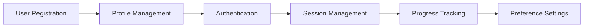
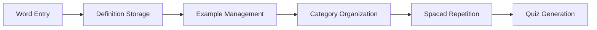
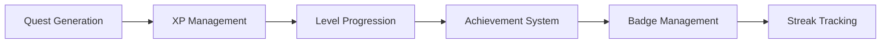
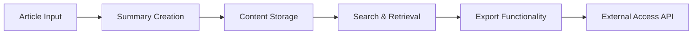
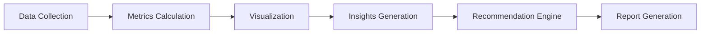
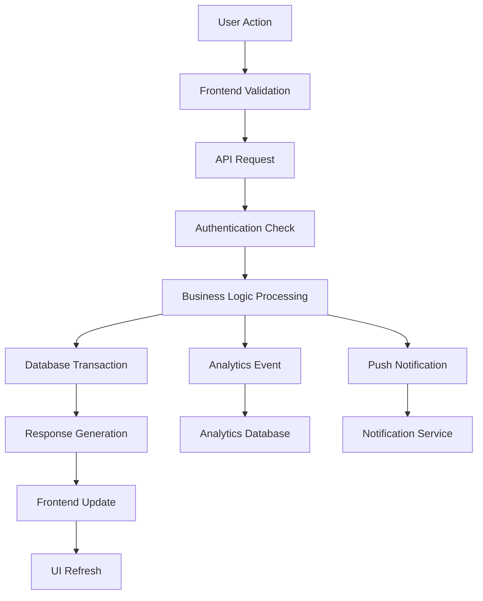
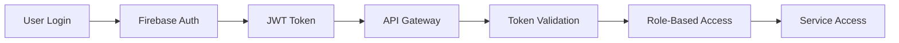
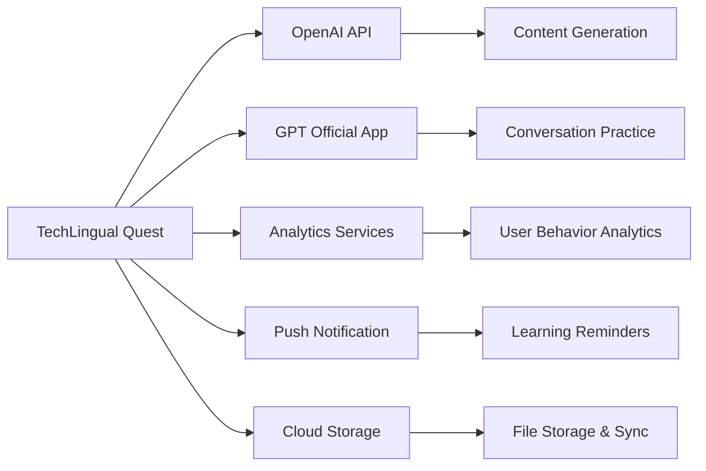
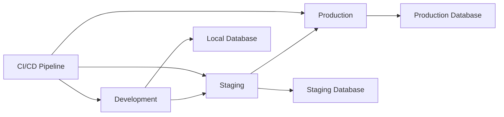

# High-Level Design (HLD) - TechLingual Quest

This document provides the system architecture overview and high-level design decisions for the TechLingual Quest application.

## Related Documents
- [Low-Level Design](LLD.md) - Detailed technical design and implementation
- [System Requirements](../requirements/system-requirements.md) - Technical system requirements
- [User Requirements](../requirements/user-requirements.md) - User stories and functional requirements
- [Development Tasks](../docs/development-tasks.md) - Implementation task breakdown

---

## 1. System Overview

### 1.1 System Purpose
TechLingual Quest is a gamified learning application designed to improve technical English skills through vocabulary building, quests, and article summarization. The system combines educational content with game-like mechanics to enhance user engagement and learning retention.

### 1.2 Key Design Principles
- **User-Centric Design**: All features prioritize user experience and learning effectiveness
- **Scalable Architecture**: System design supports future growth and feature expansion
- **Data-Driven Learning**: Spaced repetition and analytics drive personalized learning paths
- **Cross-Platform Accessibility**: Consistent experience across mobile and web platforms
- **Offline Capability**: Core functionality available without internet connection

---

## 2. System Architecture

### 2.1 Overall Architecture Diagram



### 2.2 Technology Stack

| Layer | Technology | Justification |
|-------|------------|---------------|
| **Frontend** | Flutter 3.x | Cross-platform mobile/web, single codebase |
| **Backend** | Firebase/Supabase | Rapid development, built-in auth, real-time sync |
| **Database** | Firestore/PostgreSQL | NoSQL flexibility or SQL ACID compliance |
| **Authentication** | Firebase Auth | Industry-standard security, social login support |
| **Storage** | Firebase Storage/S3 | Scalable file storage for multimedia content |
| **AI Integration** | OpenAI API | Advanced language processing capabilities |
| **Analytics** | Firebase Analytics | User behavior tracking and insights |
| **Push Notifications** | Firebase Cloud Messaging | Cross-platform notification delivery |

---

## 3. Component Design

### 3.1 User Management Component



**Responsibilities:**
- User registration and authentication
- Profile creation and management
- Session handling and security
- User preference storage
- Cross-device synchronization

### 3.2 Vocabulary Management Component



**Responsibilities:**
- Vocabulary word storage and retrieval
- Definition and example management
- Categorization and tagging
- Spaced repetition algorithm implementation
- Quiz question generation and validation

### 3.3 Quest & Gamification Component



**Responsibilities:**
- Dynamic quest creation and management
- XP calculation and level progression
- Achievement tracking and badge awarding
- Learning streak monitoring
- Reward system implementation

### 3.4 Article Summary Component



**Responsibilities:**
- Article summary creation and editing
- Content organization and storage
- Search and filtering capabilities
- Export functionality for external use
- API endpoints for third-party access

### 3.5 Progress Analytics Component



**Responsibilities:**
- Learning activity data collection
- Progress metrics calculation
- Dashboard visualization generation
- Learning insights and recommendations
- Performance analytics and reporting

---

## 4. Data Architecture

### 4.1 Data Flow Diagram



### 4.2 Database Schema Overview

#### 4.2.1 User Data Schema
```sql
-- User Profile
Users {
  id: UUID PK
  email: String UNIQUE
  username: String
  created_at: Timestamp
  last_login: Timestamp
  preferences: JSON
  learning_streak: Integer
  total_xp: Integer
  current_level: Integer
}

-- User Progress
UserProgress {
  id: UUID PK
  user_id: UUID FK
  date: Date
  vocabulary_studied: Integer
  quests_completed: Integer
  xp_gained: Integer
  study_time_minutes: Integer
}
```

#### 4.2.2 Vocabulary Data Schema
```sql
-- Vocabulary Words
Vocabulary {
  id: UUID PK
  user_id: UUID FK
  word: String
  definition: Text
  example_sentence: Text
  category: String
  difficulty_level: Integer
  created_at: Timestamp
  last_reviewed: Timestamp
  review_count: Integer
  retention_score: Float
}

-- Vocabulary Reviews
VocabularyReviews {
  id: UUID PK
  vocabulary_id: UUID FK
  reviewed_at: Timestamp
  performance_score: Integer
  time_taken_seconds: Integer
  next_review_date: Timestamp
}
```

#### 4.2.3 Quest & Gamification Schema
```sql
-- User Quests
UserQuests {
  id: UUID PK
  user_id: UUID FK
  quest_type: String
  quest_data: JSON
  status: Enum
  created_at: Timestamp
  completed_at: Timestamp
  xp_reward: Integer
}

-- User Achievements
UserAchievements {
  id: UUID PK
  user_id: UUID FK
  achievement_type: String
  achieved_at: Timestamp
  badge_data: JSON
}
```

---

## 5. Security Architecture

### 5.1 Authentication & Authorization



**Security Measures:**
- Firebase Authentication for secure user management
- JWT tokens for stateless authentication
- Role-based access control (RBAC)
- API rate limiting and throttling
- HTTPS/TLS encryption for all communications

### 5.2 Data Security

- **Encryption at Rest**: All sensitive data encrypted in database
- **Encryption in Transit**: HTTPS/TLS for all API communications
- **Personal Data Protection**: GDPR-compliant data handling
- **API Security**: Input validation, SQL injection prevention
- **Privacy Controls**: User data deletion and export capabilities

---

## 6. Integration Architecture

### 6.1 External Service Integration



**Integration Patterns:**
- RESTful API integration for external services
- Deep linking for GPT app integration
- Webhook endpoints for real-time notifications
- SDK integration for analytics and crash reporting
- Queue-based processing for AI API calls

---

## 7. Performance & Scalability Design

### 7.1 Performance Optimization

- **Frontend Performance**:
  - Lazy loading for large vocabulary lists
  - Image optimization and caching
  - Progressive web app (PWA) capabilities
  - Offline functionality with local storage

- **Backend Performance**:
  - Database query optimization with indexing
  - Caching layer for frequently accessed data
  - API response compression
  - Asynchronous processing for heavy operations

### 7.2 Scalability Considerations

- **Horizontal Scaling**: Microservices architecture supports independent scaling
- **Database Scaling**: Sharding strategy for user data partitioning
- **CDN Integration**: Global content delivery for static assets
- **Auto-scaling**: Cloud-based auto-scaling for traffic spikes

---

## 8. Deployment Architecture

### 8.1 Environment Strategy



**Environment Configuration:**
- **Development**: Local development with hot reload
- **Staging**: Production-like environment for testing
- **Production**: Live environment with monitoring and alerts

### 8.2 CI/CD Pipeline

1. **Code Commit** → Automated testing
2. **Testing** → Code quality checks and security scans
3. **Build** → Application compilation and packaging
4. **Deploy** → Automated deployment to staging/production
5. **Monitor** → Performance and error monitoring

---

## 9. Monitoring & Observability

### 9.1 Monitoring Stack

- **Application Monitoring**: Firebase Analytics for user behavior
- **Performance Monitoring**: Flutter Performance Monitoring
- **Error Tracking**: Crash reporting and error logging
- **Infrastructure Monitoring**: Cloud provider monitoring tools
- **Business Metrics**: Custom dashboards for learning analytics

### 9.2 Key Metrics to Track

- **User Engagement**: Daily active users, session duration, retention rate
- **Learning Effectiveness**: Vocabulary retention, quest completion rate
- **System Performance**: API response times, error rates, uptime
- **Business Metrics**: User growth, feature adoption, learning progress

---

## 10. Risk Mitigation

### 10.1 Technical Risks

| Risk | Probability | Impact | Mitigation Strategy |
|------|-------------|--------|-------------------|
| API Rate Limits | Medium | High | Implement caching and request optimization |
| Data Loss | Low | Critical | Automated backups and disaster recovery |
| Performance Issues | Medium | Medium | Load testing and performance monitoring |
| Security Breach | Low | Critical | Security audits and penetration testing |

### 10.2 Business Risks

| Risk | Probability | Impact | Mitigation Strategy |
|------|-------------|--------|-------------------|
| Low User Engagement | Medium | High | User research and iterative UX improvements |
| Feature Complexity | High | Medium | MVP approach and gradual feature rollout |
| Competition | Medium | Medium | Unique value proposition and rapid iteration |

---

## Version History

| Version | Date | Author | Changes |
|---------|------|--------|---------|
| 1.0 | 2025-08-29 | GitHub Copilot Agent | Initial high-level design documentation |