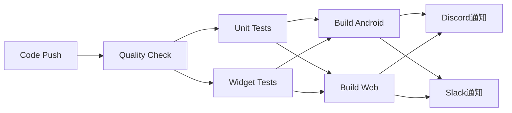

# CI/CD セットアップガイド

TechLingual QuestプロジェクトのCI/CDパイプラインの設定とDiscord/Slack通知の設定方法を説明します。

## 🔧 CI/CDパイプライン概要

### パイプライン構成



### ジョブ詳細

| ジョブ | 実行内容 | 実行時間目安 |
|--------|----------|-------------|
| **quality-check** | コード品質・依存関係チェック | 1-2分 |
| **test** | ユニット・ウィジェットテスト実行 | 2-3分 |
| **build** | Android APK・Webビルド | 3-5分 |
| **notify** | Discord/Slack通知送信 | 30秒 |

## 🔐 Repository Variables と Secrets の設定

### 必要な設定値

GitHub リポジトリの Settings → Secrets and variables → Actions で以下を設定：

#### Variables (公開情報)
- `DISCORD_WEBHOOK_URL`: Discordのwebhook URL
- `SLACK_WEBHOOK_URL`: Slackのwebhook URL

#### Secrets (機密情報)
現在は特に設定不要ですが、将来的に以下が必要になる可能性があります：
- `FIREBASE_SERVICE_ACCOUNT_KEY`: Firebase デプロイ用
- `GOOGLE_PLAY_SERVICE_ACCOUNT_KEY`: Google Play Store デプロイ用
- `APPLE_DEVELOPER_CERTIFICATE`: App Store デプロイ用

## 📢 Discord Webhook 設定

### 1. Discord サーバーでWebhook作成

1. Discord サーバーの設定 → 連携サービス → ウェブフック
2. 「新しいウェブフック」をクリック
3. 名前を「TechLingual Quest CI/CD」に設定
4. チャンネルを選択（例：#development、#ci-cd）
5. 「ウェブフックURLをコピー」をクリック

### 2. GitHub Repository Variablesに追加

1. GitHub リポジトリ → Settings → Secrets and variables → Actions
2. Variables タブ → 「New repository variable」
3. Name: `DISCORD_WEBHOOK_URL`
4. Value: コピーしたWebhook URL
5. 「Add variable」をクリック

### 3. Discord通知の内容

CI/CDパイプラインの実行結果をリッチな埋め込みメッセージで送信：

- ✅ 成功時: 緑色の埋め込み
- ❌ 失敗時: 赤色の埋め込み
- ブランチ、コミット、実行者情報
- 各ジョブの実行結果
- GitHub Actionsページへのリンク

## 📱 Slack Webhook 設定

### 1. Slack アプリでWebhook作成

1. [Slack API](https://api.slack.com/apps) → 「Create New App」
2. 「From scratch」を選択
3. App Name: 「TechLingual Quest CI/CD」
4. ワークスペースを選択
5. 「Incoming Webhooks」を有効化
6. 「Add New Webhook to Workspace」
7. チャンネルを選択（例：#development、#ci-cd）
8. Webhook URLをコピー

### 2. GitHub Repository Variablesに追加

1. GitHub リポジトリ → Settings → Secrets and variables → Actions
2. Variables タブ → 「New repository variable」
3. Name: `SLACK_WEBHOOK_URL`
4. Value: コピーしたWebhook URL
5. 「Add variable」をクリック

### 3. Slack通知の内容

構造化されたブロックレイアウトで通知：

- ヘッダーブロック（成功/失敗アイコン付き）
- 実行結果のメッセージ
- 詳細情報（ブランチ、コミット、実行者、各ジョブ結果）
- GitHub Actionsページへのボタンリンク

## 🚀 ワークフロートリガー

### 自動実行

- **push**: `main`、`develop` ブランチへのプッシュ
- **pull_request**: `main`、`develop` ブランチへのPR作成・更新

### 手動実行

- **workflow_dispatch**: GitHub Actions画面からの手動実行

## 📊 ビルド成果物

### Android APK
- ビルド成果物: `build/app/outputs/flutter-apk/*.apk`
- 保存期間: 7日間
- ダウンロード可能

### Web Build
- ビルド成果物: `build/web/`
- 保存期間: 7日間
- サイズ情報を通知に含む

## 🧪 テストカバレッジ

- `flutter test --coverage` でカバレッジ計測
- [Codecov](https://codecov.io) にカバレッジレポートをアップロード
- カバレッジレポートはPRコメントで確認可能

## ⚠️ トラブルシューティング

### よくある問題と解決方法

#### 1. 通知が送信されない

**確認項目:**
- Repository Variables が正しく設定されているか
- Webhook URLが有効か
- Discord/Slackでbotの権限が適切か

**解決方法:**
```bash
# Webhook URLをテスト
curl -X POST -H "Content-Type: application/json" \
-d '{"content": "テストメッセージ"}' \
YOUR_DISCORD_WEBHOOK_URL
```

#### 2. ビルドが失敗する

**確認項目:**
- `pubspec.yaml` の依存関係
- Flutter SDKバージョンの互換性
- プラットフォーム固有の設定

**解決方法:**
```bash
# ローカルでビルドテスト
flutter clean
flutter pub get
flutter analyze
flutter test
flutter build apk --release
flutter build web --release
```

#### 3. テストが失敗する

**確認項目:**
- テストファイルの存在確認
- テストの依存関係
- モックデータの整合性

**解決方法:**
```bash
# テストのみ実行
flutter test
# 特定のテストファイル実行
flutter test test/specific_test.dart
```

## 🔄 ワークフローのカスタマイズ

### 環境変数の調整

`.github/workflows/flutter.yml` の `env` セクションで設定：

```yaml
env:
  FLUTTER_VERSION: '3.24.3'  # Flutterバージョン
  # 将来的に追加可能：
  # JAVA_VERSION: '11'
  # NODE_VERSION: '18'
```

### 新しい通知チャンネルの追加

Microsoft Teams、LINE、カスタムAPIエンドポイントなど、他の通知先を追加可能。

### デプロイメントの追加

将来的にFirebase Hosting、Google Play Store、App Storeへの自動デプロイが追加可能。

---

## 📚 関連ドキュメント

- [Flutter CI/CD Best Practices](https://docs.flutter.dev/deployment/ci)
- [GitHub Actions Documentation](https://docs.github.com/actions)
- [Discord Webhook Guide](https://support.discord.com/hc/en-us/articles/228383668-Intro-to-Webhooks)
- [Slack Webhook Guide](https://api.slack.com/messaging/webhooks)

---

**作成日**: 2025年9月2日
**作成者**: GitHub Copilot Agent
**関連Issue**: #9 - CI/CDの構築
