# 高水準設計書 (HLD) - TechLingual Quest

**作成者:** Github Copilot Agent  
**作成日:** 2025-01-16  
**バージョン:** 2.0  
**ステータス:** 完成

このドキュメントは要件定義書に基づいて作成された、TechLingual Questアプリケーションのシステム全体アーキテクチャ設計書です。

---

## 関連ドキュメント

- [要件定義書](../requirements/requirements.md) - システム要件の詳細
- [低水準設計書 (LLD)](LLD.md) - 詳細な実装設計
- [データベース設計](../optional/db_design.md) - データベーススキーマ詳細

---

## 1. システム概要

### 1.1 システム目的
TechLingual Questは、技術系英語学習をゲーミフィケーションによって継続可能にする学習支援アプリケーションです。単語学習、記事要約、進捗管理をデータベースに蓄積し、学習以外（業務・調査）でも再利用可能な設計としています。

### 1.2 主要機能
- **クエストシステム**: 日次/週次タスク（読む・書く・聞く・話す）でXP獲得
- **単語管理**: カード式単語帳、習熟度管理、間隔反復学習
- **記事要約管理**: 技術記事の要約をDB保存、検索・フィルタリング機能
- **進捗ダッシュボード**: XP・レベル表示、学習統計グラフ
- **外部連携**: 柔軟なLLM統合（OpenAI、Ollama、LMStudio等）による会話練習・コンテンツ生成

### 1.3 システム特徴
- **クロスプラットフォーム**: モバイル（iOS/Android）とWebブラウザ対応
- **データ中心設計**: 学習データを業務・調査でも活用可能
- **ゲーミフィケーション**: XP、レベル、バッジによる継続学習支援
- **拡張性**: 新しいクエスト種別や技術分野を追加できる設計

---

## 2. システムアーキテクチャ

### 2.1 全体アーキテクチャ図

#### 2.1.1 開発初期フェーズ（ローカルDBアプローチ）

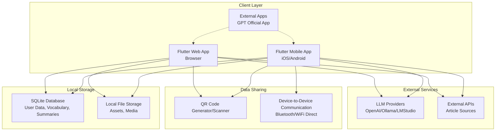

#### 2.1.2 将来のサーバーDBフェーズ

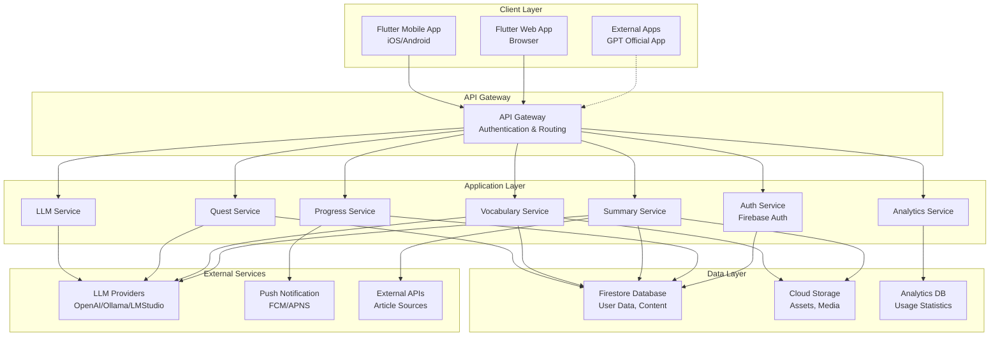

### 2.2 技術スタック

#### 2.2.1 開発初期フェーズ

| レイヤー | 技術 | 説明 |
|---------|------|------|
| **フロントエンド** | Flutter 3.x | クロスプラットフォーム（iOS/Android/Web） |
| **状態管理** | Riverpod/Provider | リアクティブ状態管理 |
| **認証** | ローカル認証 | 端末内でのユーザー識別・セッション管理 |
| **データベース** | SQLite | ローカルリレーショナルDB |
| **ストレージ** | ローカルファイルシステム | 端末内ファイル・メディア保存 |
| **データ共有** | QRコード/Bluetooth | 端末間データ共有 |
| **AI連携** | 抽象LLMプロバイダー | OpenAI/Ollama/LMStudio等対応 |
| **CI/CD** | GitHub Actions | 自動ビルド・デプロイ |

#### 2.2.2 将来のサーバーDBフェーズ

| レイヤー | 技術 | 説明 |
|---------|------|------|
| **フロントエンド** | Flutter 3.x | クロスプラットフォーム（iOS/Android/Web） |
| **状態管理** | Riverpod/Provider | リアクティブ状態管理 |
| **認証** | Firebase Auth | Google/Email認証 |
| **データベース** | Firestore | NoSQLドキュメントDB |
| **ストレージ** | Cloud Storage | ファイル・メディア保存 |
| **API** | Firebase Functions | サーバーレスAPI |
| **プッシュ通知** | FCM/APNS | モバイル通知 |
| **AI連携** | 抽象LLMプロバイダー | OpenAI/Ollama/LMStudio等対応 |
| **分析** | Firebase Analytics | ユーザー行動分析 |
| **CI/CD** | GitHub Actions | 自動ビルド・デプロイ |

### 2.3 アーキテクチャパターン

#### 2.3.1 開発初期フェーズ
- **フロントエンド**: Clean Architecture + MVVM
- **データアクセス**: Repository Pattern (Local SQLite)
- **状態管理**: Reactive Programming (Stream/Future)
- **データ共有**: P2P Communication Pattern

#### 2.3.2 将来のサーバーDBフェーズ
- **フロントエンド**: Clean Architecture + MVVM
- **バックエンド**: Microservices Architecture
- **データアクセス**: Repository Pattern (Cloud Firestore)
- **状態管理**: Reactive Programming (Stream/Future)

---

## 3. コンポーネント設計

### 3.1 フロントエンドコンポーネント

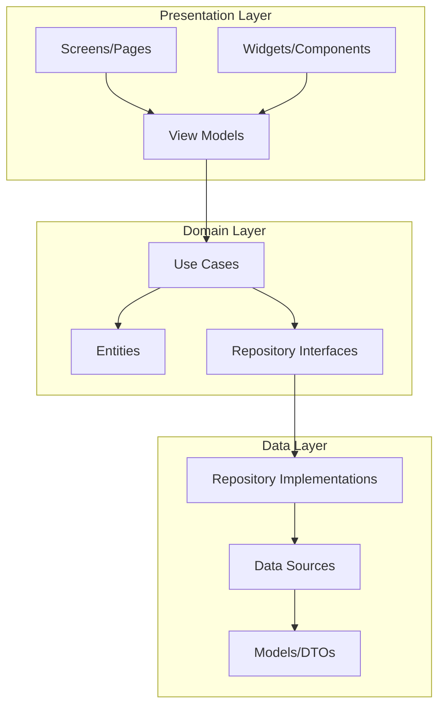

### 3.2 主要コンポーネント詳細

#### 3.2.1 認証コンポーネント
- **責務**: ユーザー認証・セッション管理
- **機能**: サインイン/アップ、プロフィール管理、権限制御
- **技術**: Firebase Auth、OAuth 2.0

#### 3.2.2 クエストコンポーネント
- **責務**: 学習タスク管理・XP計算
- **機能**: クエスト一覧表示、進捗追跡、報酬付与
- **連携**: 単語・要約・外部アプリとの連携

#### 3.2.3 単語管理コンポーネント
- **責務**: 語彙学習・習熟度管理
- **機能**: 単語CRUD、フラッシュカード、間隔反復
- **アルゴリズム**: SM-2間隔反復アルゴリズム

#### 3.2.4 要約管理コンポーネント
- **責務**: 技術記事要約の保存・検索
- **機能**: 要約CRUD、全文検索、タグフィルタ
- **連携**: 外部API（記事取得）、柔軟なLLMプロバイダー（自動要約）

#### 3.2.5 ダッシュボードコンポーネント
- **責務**: 学習進捗の可視化
- **機能**: グラフ表示、統計計算、レポート生成
- **UI**: Chart.js/FL Chart によるインタラクティブグラフ

---

## 4. データアーキテクチャ

### 4.1 データフロー図

#### 4.1.1 開発初期フェーズ（ローカルDBアプローチ）

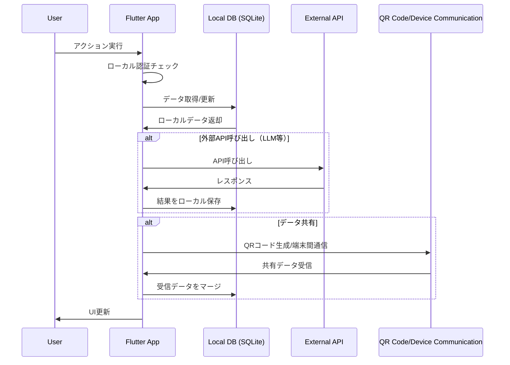

#### 4.1.2 将来のサーバーDBフェーズ

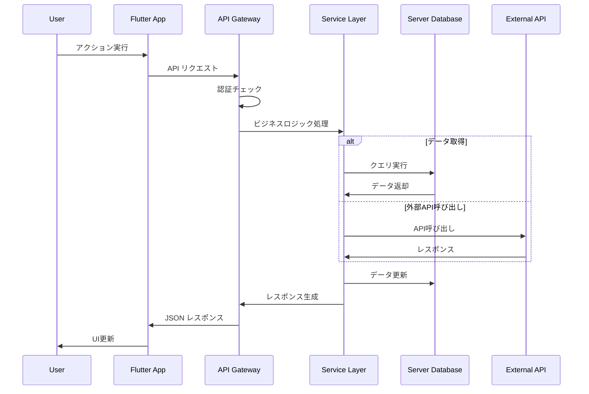

### 4.2 データモデル設計

#### 4.2.1 ユーザーデータ
```typescript
interface User {
  id: string;
  email: string;
  displayName: string;
  profileImageUrl?: string;
  level: number;
  currentXP: number;
  totalXP: number;
  badges: Badge[];
  settings: UserSettings;
  createdAt: Timestamp;
  lastLoginAt: Timestamp;
}
```

#### 4.2.2 単語データ
```typescript
interface VocabularyWord {
  id: string;
  userId: string;
  word: string;
  definition: string;
  exampleSentence: string;
  pronunciation?: string;
  category: string;
  difficultyLevel: number; // 1-5
  masteryLevel: number; // 0-100%
  reviewCount: number;
  lastReviewedAt?: Timestamp;
  nextReviewAt?: Timestamp;
  createdAt: Timestamp;
}
```

#### 4.2.3 記事要約データ
```typescript
interface ArticleSummary {
  id: string;
  userId: string;
  title: string;
  url: string;
  summary: string;
  category: string;
  tags: string[];
  characterCount: number;
  isAutoGenerated: boolean;
  sourceLanguage: 'en' | 'ja';
  createdAt: Timestamp;
  updatedAt: Timestamp;
}
```

#### 4.2.4 クエストデータ
```typescript
interface Quest {
  id: string;
  userId: string;
  type: 'read' | 'write' | 'listen' | 'speak';
  title: string;
  description: string;
  status: 'not_started' | 'in_progress' | 'completed';
  rewardXP: number;
  targetCount?: number;
  currentProgress: number;
  dueDate?: Timestamp;
  completedAt?: Timestamp;
  createdAt: Timestamp;
}
```

### 4.3 データベース要件・戦略

#### 4.3.1 開発初期のデータ管理
- 開発初期はサーバーDB（Firestore等）は利用せず、ローカルDBのみでデータを保持・管理します。

#### 4.3.2 端末間でのデータ共有
- 端末間でのデータ共有は、QRコードや端末間通信を利用します。

#### 4.3.3 資金調達後の方針
- 資金調達後にサーバーDBの導入を検討する方針です。

#### 4.3.4 設計根拠
- 初期段階では、開発コストや時間を抑えるためにローカルDBを活用し、迅速なプロトタイピングを行うことが重要です。
- QRコードや端末間通信を利用することで、ユーザー同士の直接的なデータ共有が可能になり、利便性を向上させます。

#### 4.3.5 将来的なサーバー移行案
- 資金調達が成功した場合、スケーラビリティやデータの一元管理を考慮して、サーバーDB導入を検討します。
- サーバーDB導入後は、データのバックアップやセキュリティ向上が期待でき、より多くのユーザーに対応できるインフラを整備します。

### 4.4 データベース最適化戦略

- **インデックス**: userId、category、createdAt フィールドに複合インデックス
- **パーティション**: ユーザー別データパーティション
- **キャッシュ**: 頻繁にアクセスされる統計データのRedisキャッシュ
- **アーカイブ**: 古い学習データの自動アーカイブ機能

---

## 5. セキュリティアーキテクチャ

### 5.1 認証・認可フロー

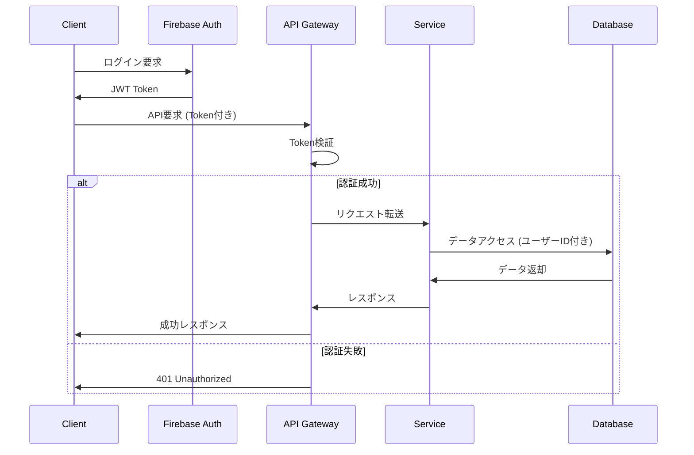

### 5.2 セキュリティ対策

| 脅威 | 対策 |
|------|------|
| **不正アクセス** | Firebase Auth、JWT Token、RBAC |
| **データ漏洩** | Firestore Rules、データ暗号化 |
| **CSRF** | SameSite Cookie、CSRF Token |
| **XSS** | CSP、入力サニタイゼーション |
| **API乱用** | Rate Limiting、API Key管理 |
| **データ改ざん** | データ整合性チェック、監査ログ |

### 5.3 プライバシー保護

- **データ匿名化**: 分析用データの個人情報除去
- **GDPR対応**: データ削除・エクスポート機能
- **同意管理**: プライバシーポリシー同意フロー
- **データ最小化**: 必要最小限のデータ収集

---

## 6. パフォーマンス・スケーラビリティ設計

### 6.1 パフォーマンス最適化

#### 6.1.1 フロントエンド最適化
- **レイジーローディング**: 画面・コンポーネントの遅延読み込み
- **画像最適化**: WebP形式、適応的サイズ調整
- **キャッシュ戦略**: API応答、静的リソースのキャッシュ
- **バンドル最適化**: コード分割、Tree Shaking

#### 6.1.2 バックエンド最適化
- **データベース最適化**: インデックス、クエリ最適化
- **CDN活用**: 静的リソースの配信高速化
- **API最適化**: レスポンス圧縮、ページネーション
- **非同期処理**: 重い処理のバックグラウンド実行

### 6.2 スケーラビリティ設計

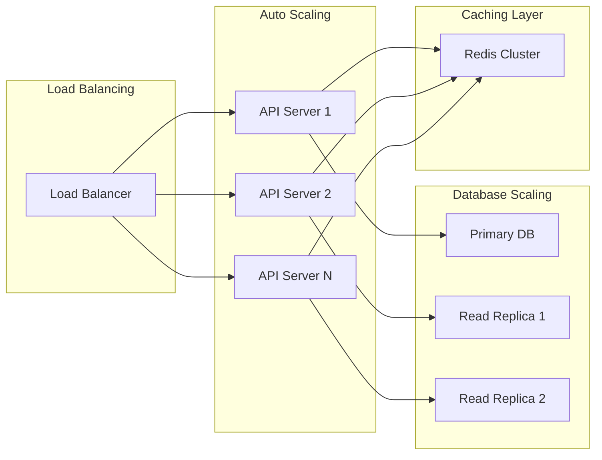

### 6.3 パフォーマンス監視

- **メトリクス**: レスポンス時間、スループット、エラー率
- **ユーザー体験**: Core Web Vitals、アプリ起動時間
- **インフラ**: CPU、メモリ、ディスク、ネットワーク使用率
- **アラート**: 閾値超過時の自動通知・対処

---

## 7. デプロイメント・運用アーキテクチャ

### 7.1 環境構成

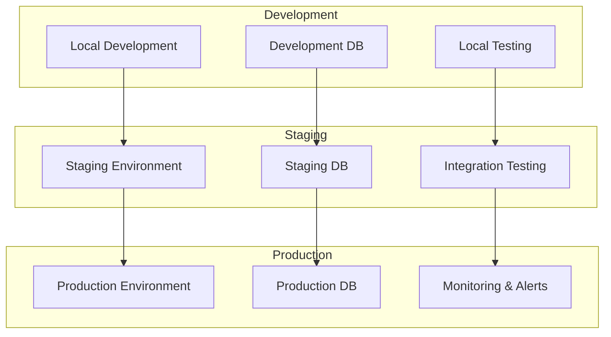

### 7.2 CI/CD パイプライン

```mermaid
graph LR
    A[Code Commit] --> B[Unit Tests]
    B --> C[Code Quality Check]
    C --> D[Security Scan]
    D --> E[Build]
    E --> F[Integration Tests]
    F --> G[Deploy to Staging]
    G --> H[E2E Tests]
    H --> I[Deploy to Production]
    I --> J[Smoke Tests]
    J --> K[Monitor & Alert]
```

### 7.3 運用監視

#### 7.3.1 ログ管理
- **構造化ログ**: JSON形式による検索可能なログ
- **ログレベル**: ERROR、WARN、INFO、DEBUG
- **ログ集約**: ELK Stack / Firebase Crashlytics

#### 7.3.2 メトリクス監視
- **システムメトリクス**: CPU、メモリ、ディスク使用率
- **アプリケーションメトリクス**: API応答時間、エラー率
- **ビジネスメトリクス**: アクティブユーザー、学習完了率

#### 7.3.3 アラート設定
- **インシデント対応**: 重要度別のエスカレーション
- **自動復旧**: 可能な範囲での自動対処
- **通知チャネル**: Slack、メール、SMS

---

## 8. 外部連携アーキテクチャ

### 8.1 GPT公式アプリ連携

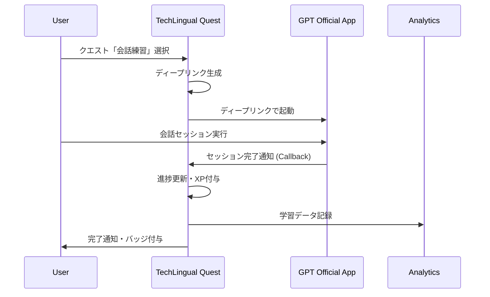

### 8.2 LLM統合アーキテクチャ

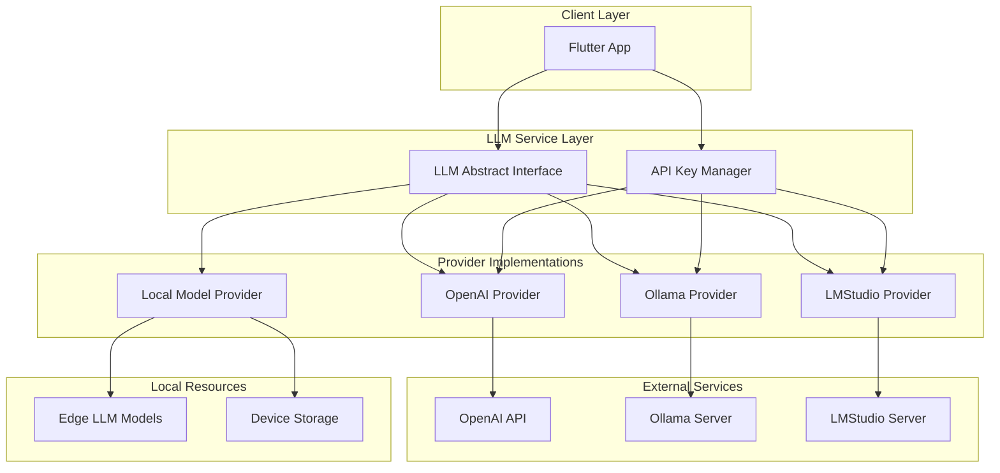

#### 8.2.1 サポート対象LLMプロバイダー

| プロバイダー | タイプ | 機能 | 用途 | 料金形態 |
|-------------|--------|------|------|---------|
| **OpenAI** | クラウドAPI | GPT-4, GPT-3.5, Whisper | 自動要約・クイズ生成・文法チェック・発音評価 | ユーザー従量課金 |
| **Ollama** | ローカル/リモート | Llama2, Mistral, Codellama | プライベート要約・クイズ生成 | 無料（ユーザー環境） |
| **LMStudio** | ローカル | 各種OSS LLM | オフライン学習支援 | 無料（ユーザー環境） |
| **ローカルモデル** | エッジ | 軽量モデル | 基本的な語彙支援 | 無料（デバイス内） |

#### 8.2.2 API キー管理

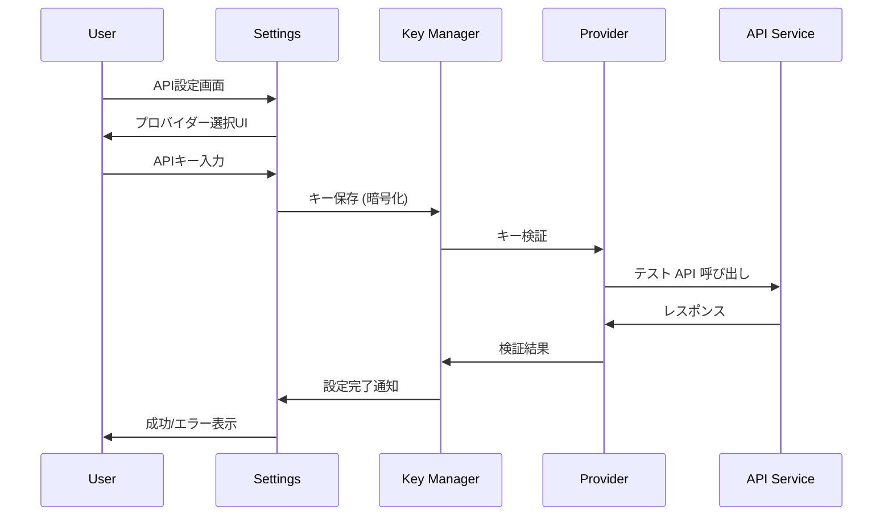

### 8.3 外部記事API連携

- **Medium API**: 技術記事の取得
- **Dev.to API**: 開発者向け記事の取得
- **GitHub API**: リポジトリ情報の取得
- **Qiita API**: 日本語技術記事の取得

---

## 9. 災害復旧・事業継続

### 9.1 バックアップ戦略

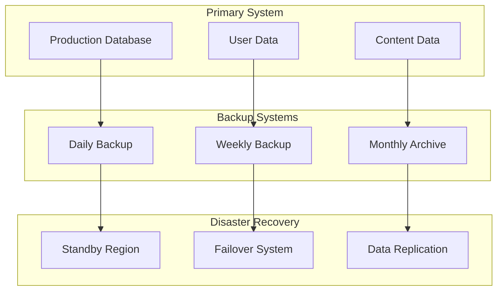

### 9.2 復旧目標

| 指標 | 目標値 | 説明 |
|------|--------|------|
| **RTO (Recovery Time Objective)** | 4時間 | サービス復旧までの最大時間 |
| **RPO (Recovery Point Objective)** | 1時間 | データ損失の最大許容時間 |
| **可用性** | 99.9% | 年間ダウンタイム上限8.76時間 |
| **データ保持** | 7年 | 法的要件に基づくデータ保持期間 |

---

## 10. 将来拡張計画

### 10.1 機能拡張ロードマップ

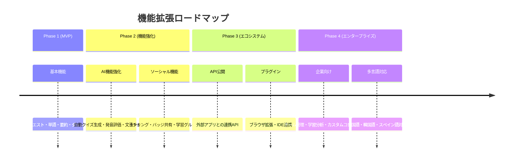

### 10.2 技術スタック進化

- **フロントエンド**: Flutter → Web Assembly対応
- **バックエンド**: サーバーレス → Kubernetes対応
- **AI**: 柔軟なLLMプロバイダー → エッジAI統合・自社モデル検討
- **データベース**: Firestore → Multi-cloud対応

---

## 11. リスク分析・軽減策

### 11.1 技術リスク

| リスク | 影響度 | 発生確率 | 軽減策 |
|--------|--------|----------|--------|
| **Firebase依存** | 高 | 中 | マルチクラウド対応、移行計画策定 |
| **LLMプロバイダー依存** | 中 | 低 | 複数プロバイダー対応、ローカルモデル対応 |
| **Flutter互換性** | 中 | 低 | 定期的なSDKアップデート、互換性テスト |
| **データ移行** | 高 | 低 | 段階的移行、ロールバック計画 |

### 11.2 事業リスク

| リスク | 影響度 | 発生確率 | 軽減策 |
|--------|--------|----------|--------|
| **競合出現** | 中 | 高 | 差別化機能強化、ユーザー体験向上 |
| **法規制変更** | 高 | 中 | 法務チーム連携、コンプライアンス強化 |
| **ユーザー離脱** | 高 | 中 | エンゲージメント分析、機能改善 |
| **収益化困難** | 高 | 中 | 複数収益モデル検討、MVP検証 |

---

## 12. 品質保証・テスト戦略

### 12.1 テスト戦略

```mermaid
pyramid
    title Testing Pyramid
    
    "E2E Tests<br/>User Journey" : 5
    "Integration Tests<br/>API & DB" : 15
    "Unit Tests<br/>Business Logic" : 80
```

### 12.2 テスト種別

| テスト種別 | 範囲 | ツール | 自動化率 |
|------------|------|--------|----------|
| **単体テスト** | クラス・関数レベル | Flutter Test | 100% |
| **結合テスト** | API・DB連携 | Postman/Newman | 90% |
| **UI テスト** | 画面操作・表示 | Flutter Driver | 70% |
| **E2E テスト** | ユーザージャーニー | Detox/Appium | 50% |
| **パフォーマンステスト** | 負荷・レスポンス | Artillery | 80% |
| **セキュリティテスト** | 脆弱性検査 | OWASP ZAP | 60% |

---

## バージョン履歴

| バージョン | 日付 | 変更内容 | 作成者 |
|------------|------|----------|--------|
| 1.0 | 2025-08-29 | 初期版作成（プレースホルダー） | Sora_Kisaragi |
| 2.0 | 2025-01-16 | 包括的なHLD設計書完成 | Sora_Kisaragi |

---

*このドキュメントは要件定義書に基づいて作成され、システム実装の指針となる設計文書です。*