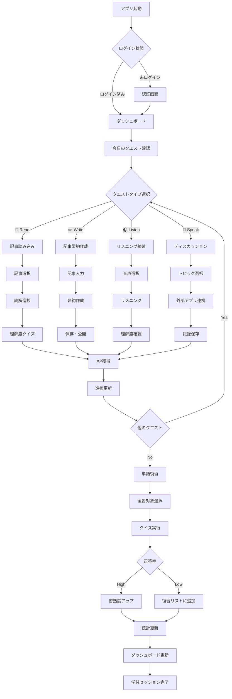

# 学習フローワイヤーフレーム

## フロー概要
ユーザーの学習プロセス全体を可視化。クエスト開始から完了までの流れ。

## 学習フロー全体図



## 画面遷移詳細

### 1. アプリ起動〜ダッシュボード

```
┌─────────────────────────┐    ┌─────────────────────────┐
│ スプラッシュ画面         │    │ ダッシュボード           │
│                         │ -> │                         │
│ 📱 TechLingual Quest    │    │ 🏠 Today's Quest        │
│    Loading...           │    │ ████████████ Level 5    │
│                         │    │                         │
│ [⚡] 初期化中...        │    │ [📖] [✏️] [🎧] [💬]   │
└─────────────────────────┘    └─────────────────────────┘
```

### 2. クエスト選択〜実行

```
┌─────────────────────────┐    ┌─────────────────────────┐    ┌─────────────────────────┐
│ クエスト選択             │    │ タスク実行画面           │    │ 完了・評価画面           │
│                         │    │                         │    │                         │
│ 📖 Read Article         │ -> │ 📰 Quantum Computing    │ -> │ ✅ Task Completed       │
│ 50 XP • 15 min          │    │                         │    │                         │
│                         │    │ [Progress: ████░░░ 60%] │    │ 🏆 +50 XP Earned       │
│ [Start Quest]           │    │                         │    │                         │
│                         │    │ [Continue] [Pause]      │    │ [Next Quest] [Finish]   │
└─────────────────────────┘    └─────────────────────────┘    └─────────────────────────┘
```

### 3. 単語学習フロー

```
┌─────────────────────────┐    ┌─────────────────────────┐    ┌─────────────────────────┐
│ 単語帳画面               │    │ クイズ画面               │    │ 結果画面                 │
│                         │    │                         │    │                         │
│ 📚 127 words total      │ -> │ What does "latent" mean?│ -> │ 📊 Quiz Results         │
│                         │    │                         │    │                         │
│ ⏳ 32 need review       │    │ A) 潜在的な              │    │ ✅ 8/10 correct (80%)  │
│                         │    │ B) 明確な                │    │                         │
│ [Start Quiz]            │    │ C) 複雑な                │    │ 🎯 2 words need review │
│                         │    │ D) 簡単な                │    │                         │
│                         │    │                         │    │ [Review Wrong] [Next]   │
│                         │    │ [Submit Answer]         │    │                         │
└─────────────────────────┘    └─────────────────────────┘    └─────────────────────────┘
```

## 状態管理フロー

### クエスト進捗状態

```
未開始 (○) → 進行中 (⏳) → 一時停止 (⏸️) → 完了 (✅)
   ↑                           ↓
   └──── リセット ←─────────────┘

状態変更イベント:
- 開始: スタートボタンタップ
- 進行中: タスク実行中
- 一時停止: ポーズボタン、アプリ切り替え
- 完了: タスク条件達成
- リセット: 手動リセット、エラー発生
```

### XP・レベル更新フロー

```
タスク完了 → XP計算 → XP加算 → レベル判定 → 通知表示
                      ↓          ↓
                   統計更新 → バッジ判定
                              ↓
                         新規バッジ通知
```

## エラー処理フロー

### ネットワークエラー

```
┌─────────────────────────┐    ┌─────────────────────────┐
│ 通信エラー画面           │    │ オフラインモード         │
│                         │    │                         │
│ ❌ Connection Failed    │ -> │ 📡 Offline Mode         │
│                         │    │                         │
│ データ同期できません     │    │ ローカルデータで継続     │
│                         │    │                         │
│ [Retry] [Offline Mode]  │    │ [Continue] [Retry Sync] │
└─────────────────────────┘    └─────────────────────────┘
```

### データ競合処理

```
競合検出 → ユーザー選択 → データマージ → 同期完了
    ↓         ↓             ↓         ↓
 ログ記録  [Local][Remote] バックアップ 統計更新
          [Merge][Cancel]
```

## 学習パターン分析フロー

### 1. データ収集
```
学習行動 → ログ記録 → データ蓄積 → パターン分析
   ↓         ↓         ↓         ↓
時間記録   操作履歴  成績データ  AI分析
```

### 2. 個人化推奨
```
分析結果 → 推奨生成 → ユーザー通知 → フィードバック収集
   ↓         ↓         ↓         ↓
弱点特定  最適化案  プッシュ通知 改善点収集
```

## 外部アプリ連携フロー

### ChatGPT連携

```
┌─────────────────────────┐    ┌─────────────────────────┐    ┌─────────────────────────┐
│ ディスカッション選択     │    │ 外部アプリ起動           │    │ 結果記録                 │
│                         │    │                         │    │                         │
│ 💬 Quantum Computing    │ -> │ 🤖 ChatGPT              │ -> │ 📝 Session Completed    │
│                         │    │                         │    │                         │
│ Topics: [superposition] │    │ Context: Quantum...     │    │ Duration: 15min         │
│                         │    │                         │    │                         │
│ [Open ChatGPT]          │    │ [External App]          │    │ +25 XP                  │
└─────────────────────────┘    └─────────────────────────┘    └─────────────────────────┘
```

## データ同期フロー

### デバイス間同期

```
変更検出 → 競合チェック → データマージ → 全デバイス配信
   ↓         ↓            ↓          ↓
ローカル変更 タイムスタンプ マスターデータ 同期完了通知
           比較          作成
```

## 継続学習サポートフロー

### リマインダー・通知

```
時間チェック → 条件判定 → 通知生成 → ユーザー反応
   ↓           ↓         ↓         ↓
学習履歴分析  目標設定   プッシュ送信 継続/延期判定
```

### 習慣形成支援

```
連続日数追跡 → ストリーク表示 → モチベーション維持 → 長期継続
    ↓           ↓            ↓              ↓
カレンダー表示 バッジ付与    励ましメッセージ  習慣定着
```