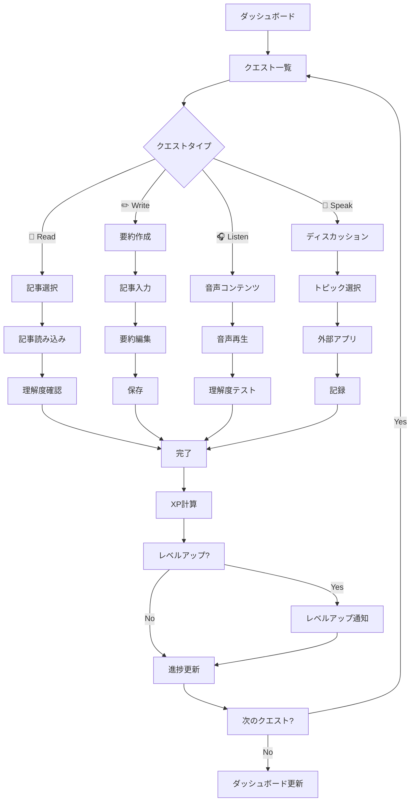

# クエストシステムワイヤーフレーム

## 画面概要
日次・週次クエストの管理、進捗追跡、XP獲得システム。

## クエストフロー図



## クエスト一覧画面

```
┌─────────────────────────────────────┐
│ [←] Daily Quests              [📊] │ ← ヘッダー
├─────────────────────────────────────┤
│                                     │
│ Today's Progress  ████████████░░ 75%│ ← 日次進捗
│ 3/4 quests completed • 180/240 XP  │
│                                     │
│ [Today] [This Week] [Custom]        │ ← 期間フィルター
│                                     │
│ Available Quests                    │ ← 利用可能クエスト
│ ┌─────────────────────────────────┐ │
│ │ 📖 Read Technical Article       │ │ ← クエストカード
│ │ "Introduction to Quantum..."    │ │
│ │ ⏱️ 15 min • 🏆 50 XP • 🎯 Medium│ │
│ │ [Start Quest]             ✅    │ │
│ └─────────────────────────────────┘ │
│                                     │
│ ┌─────────────────────────────────┐ │
│ │ ✏️ Write Article Summary        │ │ ← クエストカード
│ │ Summarize today's reading       │ │
│ │ ⏱️ 20 min • 🏆 75 XP • 🎯 Hard  │ │
│ │ [Start Quest]             ⏳    │ │
│ └─────────────────────────────────┘ │
│                                     │
│ ┌─────────────────────────────────┐ │
│ │ 🎧 Listen to Tech Podcast       │ │ ← クエストカード
│ │ "The Future of AI Development"  │ │
│ │ ⏱️ 25 min • 🏆 60 XP • 🎯 Medium│ │
│ │ [Start Quest]             ○     │ │
│ └─────────────────────────────────┘ │
│                                     │
│ ┌─────────────────────────────────┐ │
│ │ 💬 Discuss with AI              │ │ ← クエストカード
│ │ Topic: Machine Learning Basics  │ │
│ │ ⏱️ 10 min • 🏆 40 XP • 🎯 Easy  │ │
│ │ [Start Quest]             ○     │ │
│ └─────────────────────────────────┘ │
│                                     │
└─────────────────────────────────────┘
```

## クエスト詳細画面

```
┌─────────────────────────────────────┐
│ [←] Quest Details             [⭐] │ ← ヘッダー
├─────────────────────────────────────┤
│                                     │
│ 📖 Read Technical Article           │ ← クエストタイトル
│                                     │
│ Description:                        │ ← 説明
│ Read and understand the fundamentals│
│ of quantum computing technology.    │
│ Focus on key concepts and terminology.│
│                                     │
│ Quest Details:                      │ ← 詳細情報
│ ┌─────────────────────────────────┐ │
│ │ 📄 Article: "Quantum Computing  │ │
│ │    Fundamentals"                │ │
│ │ 📊 Difficulty: Medium (B2)      │ │
│ │ ⏱️ Estimated Time: 15 minutes   │ │
│ │ 🏆 XP Reward: 50 XP             │ │
│ │ 🎯 Learning Goals:              │ │
│ │    • Understand quantum basics  │ │
│ │    • Learn 5+ new terms         │ │
│ │    • Complete comprehension quiz│ │
│ └─────────────────────────────────┘ │
│                                     │
│ Prerequisites:                      │ ← 前提条件
│ ✅ Complete "Basic Physics" quest   │
│ ✅ Learn 20+ vocabulary words       │
│                                     │
│ Bonus Objectives: (+25 XP)         │ ← ボーナス目標
│ • Take notes during reading         │
│ • Share summary with community      │
│ • Complete in under 12 minutes     │
│                                     │
│ [Start Quest] [Save for Later]      │ ← アクションボタン
│                                     │
└─────────────────────────────────────┘
```

## クエスト実行画面（読書）

```
┌─────────────────────────────────────┐
│ [⏸️] Quantum Computing       ⏱️ 08:45│ ← ヘッダー・タイマー
├─────────────────────────────────────┤
│                                     │
│ Progress: ████████████░░░░░░░ 75%   │ ← 進捗バー
│ Section 3 of 4                      │
│                                     │
│ ┌─────────────────────────────────┐ │
│ │ Quantum Computing Fundamentals  │ │ ← 記事コンテンツ
│ │                                 │ │
│ │ Quantum computers leverage      │ │
│ │ quantum mechanical phenomena    │ │
│ │ such as superposition and       │ │
│ │ entanglement to process         │ │
│ │ information...                  │ │
│ │                                 │ │
│ │ Key terms in this section:      │ │
│ │ • Superposition: The ability... │ │
│ │ • Entanglement: A quantum...    │ │ ← 重要語句ハイライト
│ │ • Qubit: The basic unit...      │ │
│ └─────────────────────────────────┘ │
│                                     │
│ New Words Found: 3                  │ ← 学習状況
│ Notes Taken: 2                      │
│                                     │
│ [💡] Add to Vocabulary              │ ← アクションボタン
│ [📝] Take Notes                     │
│ [▶️] Continue Reading               │
│                                     │
└─────────────────────────────────────┘
```

## クエスト完了画面

```
┌─────────────────────────────────────┐
│ [✕] Quest Completed!          [🔗] │ ← ヘッダー
├─────────────────────────────────────┤
│                                     │
│ 🎉 Excellent Work!                  │ ← 成功メッセージ
│                                     │
│ Quest: Read Technical Article       │ ← 完了クエスト
│ Completed in: 12:34 (⚡ Bonus!)     │ ← 完了時間・ボーナス
│                                     │
│ Rewards Earned:                     │ ← 獲得リワード
│ ┌─────────────────────────────────┐ │
│ │ 🏆 +50 XP (Base)                │ │
│ │ ⚡ +25 XP (Speed Bonus)         │ │
│ │ 📚 +3 New Vocabulary Words      │ │
│ │ 🏅 "Speed Reader" Badge         │ │
│ └─────────────────────────────────┘ │
│                                     │
│ Level Progress:                     │ ← レベル進捗
│ ████████████████████░ Level 5       │
│ 2525/3000 XP (+75 XP)              │
│                                     │
│ Achievement Unlocked! 🎖️            │ ← 実績解除
│ ┌─────────────────────────────────┐ │
│ │ 🚀 "Quantum Explorer"           │ │
│ │ Complete 5 quantum-related      │ │
│ │ quests                          │ │
│ └─────────────────────────────────┘ │
│                                     │
│ Next Suggested Quest:               │ ← 次のクエスト提案
│ ✏️ "Write Quantum Summary" (75 XP) │
│                                     │
│ [Continue Learning] [Share Result]  │ ← アクション
│                                     │
└─────────────────────────────────────┘
```

## 週間クエスト画面

```
┌─────────────────────────────────────┐
│ [←] Weekly Challenges         [🏆] │ ← ヘッダー
├─────────────────────────────────────┤
│                                     │
│ Week 35 • Sep 2-8, 2024             │ ← 週間表示
│ ████████████░░░░░░░░ 70% (5/7 days) │ ← 週間進捗
│                                     │
│ This Week's Challenges              │ ← 週間チャレンジ
│ ┌─────────────────────────────────┐ │
│ │ 🎯 Complete 15 Daily Quests     │ │ ← チャレンジ項目
│ │ Progress: ███████████░░ 9/15    │ │
│ │ Reward: 200 XP + Badge          │ │
│ └─────────────────────────────────┘ │
│                                     │
│ ┌─────────────────────────────────┐ │
│ │ 📚 Learn 25 New Words           │ │
│ │ Progress: ████████████░ 18/25   │ │
│ │ Reward: 150 XP                  │ │
│ └─────────────────────────────────┘ │
│                                     │
│ ┌─────────────────────────────────┐ │
│ │ ✏️ Write 3 Article Summaries    │ │
│ │ Progress: ████████░░░░ 2/3      │ │
│ │ Reward: 300 XP + Badge          │ │
│ └─────────────────────────────────┘ │
│                                     │
│ Weekly Bonus Quest (Unlocked!)     │ ← ボーナスクエスト
│ ┌─────────────────────────────────┐ │
│ │ 🌟 Master of Technology         │ │
│ │ Complete one quest from each    │ │
│ │ category (Read/Write/Listen/    │ │
│ │ Speak) in a single day          │ │
│ │                                 │ │
│ │ Today: 📖✅ ✏️❌ 🎧❌ 💬❌     │ │
│ │ Reward: 500 XP + Special Badge │ │
│ │                                 │ │
│ │ [View Details]                  │ │
│ └─────────────────────────────────┘ │
│                                     │
└─────────────────────────────────────┘
```

## カスタムクエスト作成画面

```
┌─────────────────────────────────────┐
│ [←] [💾] Create Quest          [?] │ ← ヘッダー
├─────────────────────────────────────┤
│                                     │
│ Quest Type                          │ ← クエストタイプ選択
│ ┌─────────────────────────────────┐ │
│ │ ◉ Reading Comprehension         │ │
│ │ ○ Writing Exercise              │ │
│ │ ○ Listening Practice            │ │
│ │ ○ Speaking Challenge            │ │
│ │ ○ Vocabulary Quiz               │ │
│ │ ○ Mixed Challenge               │ │
│ └─────────────────────────────────┘ │
│                                     │
│ Quest Details                       │ ← 詳細設定
│ ┌─────────────────────────────────┐ │
│ │ Title:                          │ │
│ │ [Custom Tech Article Reading]   │ │
│ │                                 │ │
│ │ Description:                    │ │
│ │ [Read and analyze a technical   │ │
│ │  article on a topic of choice]  │ │
│ │                                 │ │
│ │ Difficulty: [Medium ▼]          │ │
│ │ Estimated Time: [15] minutes    │ │
│ │ XP Reward: [50] XP              │ │
│ └─────────────────────────────────┘ │
│                                     │
│ Content Source                      │ ← コンテンツソース
│ ┌─────────────────────────────────┐ │
│ │ ◉ Provide URL                   │ │
│ │ [https://example.com/article]   │ │
│ │                                 │ │
│ │ ○ Upload text file              │ │
│ │ ○ Enter text manually           │ │
│ └─────────────────────────────────┘ │
│                                     │
│ Learning Objectives                 │ ← 学習目標
│ [+ Add Objective]                   │
│ • Understand main concepts          │
│ • Learn domain-specific vocabulary  │
│                                     │
│ [Save Quest] [Preview] [Cancel]     │ ← アクション
│                                     │
└─────────────────────────────────────┘
```

## クエスト統計画面

```
┌─────────────────────────────────────┐
│ [←] Quest Statistics          [📤] │ ← ヘッダー
├─────────────────────────────────────┤
│                                     │
│ Overall Performance                 │ ← 全体パフォーマンス
│ ┌─────────────────────────────────┐ │
│ │ Total Quests: 156               │ │
│ │ Completion Rate: 89%            │ │
│ │ Average Score: 85/100           │ │
│ │ Total XP Earned: 8,450          │ │
│ └─────────────────────────────────┘ │
│                                     │
│ Quest Type Breakdown               │ ← タイプ別分析
│ ┌─────────────────────────────────┐ │
│ │ 📖 Reading: ████████████░ 45    │ │
│ │ ✏️ Writing: ████████░░░░ 32     │ │
│ │ 🎧 Listening: ██████░░░░░ 28    │ │
│ │ 💬 Speaking: ████░░░░░░░ 18     │ │
│ └─────────────────────────────────┘ │
│                                     │
│ Weekly Trends                       │ ← 週間トレンド
│ ┌─────────────────────────────────┐ │
│ │     Quests per Week             │ │
│ │ 20┌─┐                          │ │
│ │   │ │   ┌─┐                    │ │
│ │ 15│ │ ┌─┤ │                    │ │
│ │   │ │ │ │ │ ┌─┐                │ │
│ │ 10└─┘ └─┘ └─┘ └─┘              │ │
│ │   W1  W2  W3  W4               │ │
│ └─────────────────────────────────┘ │
│                                     │
│ Recent Achievements                 │ ← 最近の実績
│ • 🏆 Completed 150th quest          │
│ • 🔥 7-day quest streak             │
│ • 🎯 100% weekly completion         │
│                                     │
│ Personal Best Records               │ ← 個人記録
│ • Fastest completion: 8:32 (Reading)│
│ • Highest score: 98/100            │
│ • Longest streak: 14 days          │
│                                     │
└─────────────────────────────────────┘
```

## インタラクション

1. **クエスト選択**: 難易度・時間・報酬でフィルタリング
2. **進捗追跡**: リアルタイム進捗バー・タイマー
3. **自動保存**: 中断・再開機能
4. **報酬アニメーション**: XP獲得・レベルアップの視覚効果
5. **ソーシャル機能**: 結果共有・ランキング比較

## XP計算システム

- **基本XP**: クエスト完了による基本報酬
- **時間ボーナス**: 予想時間内完了で追加XP
- **精度ボーナス**: 高スコア達成で追加XP
- **連続ボーナス**: ストリーク維持で乗数効果
- **難易度係数**: 高難易度クエストで増加率向上
