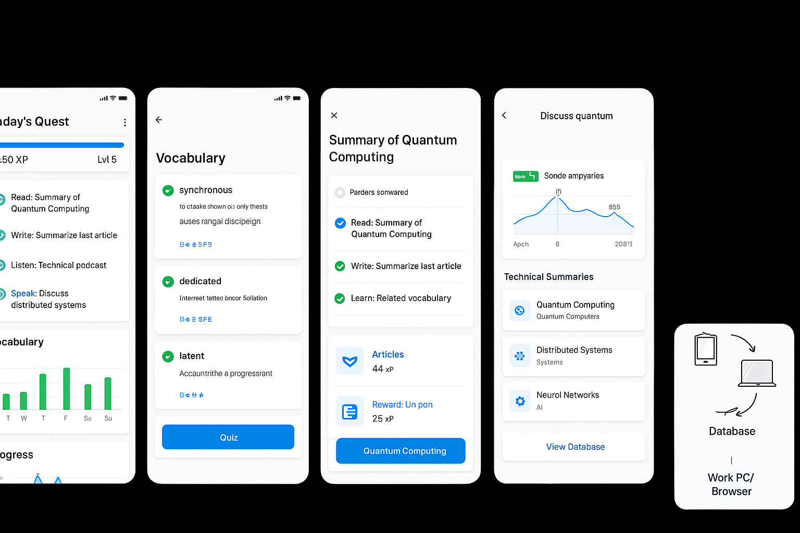

# オリジナルワイヤーフレーム画像

## 画像情報
- **ファイル名**: main_app_wireframe.png
- **ソース**: GitHub Issue #7 コメント
- **URL**: https://github.com/user-attachments/assets/0a48e7be-a9ee-4b74-ab05-9130a4107f89

## 画像内容説明

この画像には、TechLingual Questアプリケーションの主要な4つの画面のワイヤーフレームが表示されています：

### 画面1: ダッシュボード
- **タイトル**: "Today's Quest"
- **XP表示**: 2450 XP, Level 5
- **プログレスバー**: 青色のXP進捗表示
- **クイックアクション**:
  - 📖 Read: Summary of Quantum Computing
  - ✏️ Write: Summarize last article  
  - 🎧 Listen: Technical podcast
  - 💬 Speak: Discuss distributed systems
- **単語学習統計**: 週間グラフ（棒グラフ形式）
- **曜日表示**: T, W, T, F, Sa, Su

### 画面2: 単語学習画面
- **タイトル**: "Vocabulary"
- **学習済み単語リスト**:
  - synchronous (✅) - "to ctaske shown に only thesis auses rangal discipeign" - [B2] [⭐] [SFB]
  - dedicated (✅) - "Internett letterd oncor foliation" - [B2] [⭐] [SFE]  
  - latent (✅) - "Accuuntrithe a progressrant" - [B1] [⭐⭐] [#]
- **クイズボタン**: 画面下部の青いボタン

### 画面3: 記事要約画面
- **タイトル**: "Summary of Quantum Computing"
- **作成者**: "Parders somvared"
- **完了タスク**:
  - ✅ Read: Summary of Quantum Computing
  - ✅ Write: Summarize last article
  - ✅ Learn: Related vocabulary
- **リワードセクション**:
  - 📰 Articles: 44 XP
  - 📄 Reward: Un pon: 25 XP
- **アクションボタン**: "Quantum Computing"

### 画面4: ディスカッション画面
- **タイトル**: "Discuss quantum"
- **参加者**: "Sonde ampyaries" (緑のオンライン表示)
- **統計グラフ**: 855の値を示す棒グラフ（Apr 8, 2023:1の表示）
- **技術要約セクション**:
  - ⚛️ Quantum Computing - Quantum Computers
  - 🕸️ Distributed Systems - Systems  
  - 🧠 Neural Networks - AI
- **データベース連携**: "View Database"ボタン

### 画面5: データベース連携図
- **モバイルデバイス**: 📱アイコン
- **矢印**: デバイス間の双方向データ転送
- **デスクトップ/ブラウザ**: 💻アイコン
- **データベース**: "Database"ラベル
- **説明**: "Work PC/Browser"

## 設計上の特徴

1. **ゲーミフィケーション要素**: XP、レベル、進捗バー、バッジ
2. **学習の4技能**: Read, Write, Listen, Speak
3. **データ中心設計**: 学習データの蓄積と再利用
4. **クロスプラットフォーム**: モバイル⇔デスクトップ同期
5. **外部連携**: 技術記事、AI対話の統合

## 技術的考慮事項

- **レスポンシブデザイン**: モバイルファーストのUI
- **データ同期**: ローカル⇔クラウド間の同期機能
- **プログレス管理**: リアルタイムでの学習進捗追跡
- **カテゴリー分類**: 技術分野別の内容整理

## 実装時の参考ポイント

- 各画面の情報密度とレイアウトバランス
- ナビゲーションの一貫性
- ユーザーアクションの明確な表示
- データ可視化の効果的な活用
- モバイルでの操作性を重視したボタン配置

この画像は、アプリ全体のUX設計の基礎として活用され、詳細な画面設計の際の参考資料となります。