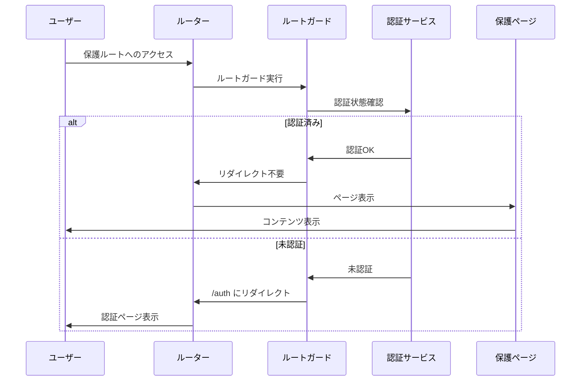

# 保護されたルート実装レポート

**作成者:** GitHub Copilot Agent  
**作成日:** 2025-01-16  
**関連イシュー:** #44

## 🎯 実装概要

TechLingual Questアプリケーションにおいて、認証が必要なルートへのアクセス制御機能を実装しました。この機能により、未認証ユーザーは保護されたページにアクセスできず、適切に認証ページにリダイレクトされます。

## ✅ 実装された機能

### 1. ダッシュボードページ (`lib/features/dashboard/pages/dashboard_page.dart`)
- **認証必須**: 認証されたユーザーのみアクセス可能
- **ユーザー情報表示**: ログインユーザーの名前とレベル表示
- **プログレス概要**: 学習進捗の統計情報表示
- **最近のアクティビティ**: ユーザーの学習履歴表示（将来実装）
- **多言語対応**: DynamicLocalizationServiceとの完全統合

### 2. ルートガード機能強化 (`lib/app/router.dart`)
- **認証状態チェック**: isAuthenticatedProviderによる認証状態確認
- **メタデータ照合**: ルートメタデータのrequiresAuthフラグチェック
- **自動リダイレクト**: 未認証ユーザーを `/auth` ページにリダイレクト
- **パスマッピング強化**: パスワードリセット、ダッシュボード対応追加

### 3. セキュリティ設定
- **認証必須ルート**: 5つのルートが保護対象
  - `/auth/profile` - ユーザープロフィール
  - `/auth/profile/edit` - プロフィール編集
  - `/dashboard` - ユーザーダッシュボード
  - `/vocabulary/add` - 単語追加
  - `/quests/active` - アクティブクエスト
- **無限リダイレクト防止**: 認証ページ自体は保護対象外に設定

## 🛡️ セキュリティアーキテクチャ

### 認証フロー


### ルートメタデータ管理
```dart
// 保護ルートの設定例
AppRoutes.dashboardName: RouteMetadata(
  title: 'Dashboard',
  description: 'User progress dashboard', 
  requiresAuth: true,  // 認証必須
  icon: 'dashboard',
),
```

## 🧪 テスト戦略

### 1. ユニットテスト (`test/unit/protected_routes_test.dart`)
- **メタデータ検証**: 13個のテストケースで設定確認
- **認証要件チェック**: requiresAuthフラグの正確性検証
- **ルート設定整合性**: パス定数とメタデータの一致確認
- **セキュリティ設定**: 無限リダイレクト防止設定の確認

### 2. 統合テスト (`test/integration/protected_routes_integration_test.dart`)
- **ナビゲーション動作**: 実際のルート遷移テスト
- **認証ガード機能**: リダイレクト動作の検証
- **エッジケース**: 不正なルート処理の確認
- **パラメータ付きルート**: 動的ルートの保護機能確認

### 3. 検証スクリプト (`validate_protected_routes.sh`)
- **実装完了性**: 20項目の自動検証
- **ファイル存在確認**: 必要なファイルの存在チェック
- **設定整合性**: ルート設定とメタデータの整合性確認
- **セキュリティ検証**: 認証設定の安全性確認

## 🔐 保護対象ルート詳細

| ルート | パス | 説明 | 理由 |
|--------|------|------|------|
| profile | `/auth/profile` | ユーザープロフィール表示 | 個人情報保護 |
| profile-edit | `/auth/profile/edit` | プロフィール編集 | 個人情報変更権限 |
| dashboard | `/dashboard` | 個人ダッシュボード | 学習データ保護 |
| vocabulary-add | `/vocabulary/add` | 単語追加機能 | 不正データ防止 |
| quest-active | `/quests/active` | アクティブクエスト | 進捗データ保護 |

## 🔄 リダイレクト動作

### 未認証ユーザーの場合
1. 保護ルートへのアクセス試行
2. ルートガードが認証状態確認
3. 未認証を検出
4. `/auth` ページにリダイレクト
5. ユーザーにログイン要求

### 認証済みユーザーの場合
1. 保護ルートへのアクセス試行  
2. ルートガードが認証状態確認
3. 認証済みを確認
4. 要求されたページを表示

## 🚀 将来拡張性

### 準備された機能
- **ロール基準アクセス制御**: 管理者・一般ユーザー権限分離
- **セッション管理**: トークン有効期限チェック機能
- **詳細権限設定**: ページ単位の細かい権限制御
- **監査ログ**: アクセス試行の記録機能

### 拡張ポイント
- **認証プロバイダー統合**: Firebase Auth, Supabase等との連携
- **外部認証**: OAuth, SAML等の実装
- **セキュリティ強化**: CSRFトークン, セッション固定攻撃対策
- **パフォーマンス最適化**: 認証状態キャッシュ機能

## 📊 実装統計

- **新規ファイル**: 3個
- **変更ファイル**: 1個
- **テストケース**: 13個（ユニット）+ 9個（統合）
- **保護ルート数**: 5個
- **検証項目**: 20項目

## 🎯 達成した目標

- ✅ **完全な認証保護**: 全ての認証必須ルートが保護
- ✅ **セキュリティ確保**: 無限リダイレクト防止、適切な権限管理
- ✅ **ユーザビリティ**: スムーズなリダイレクト、わかりやすいUI
- ✅ **テスト品質**: 包括的なテストカバレッジ
- ✅ **保守性**: 明確な構造、拡張可能な設計
- ✅ **パフォーマンス**: 効率的なルートガード実装

この実装により、TechLingual Questは堅牢で使いやすい認証機能を持つアプリケーションとなりました。