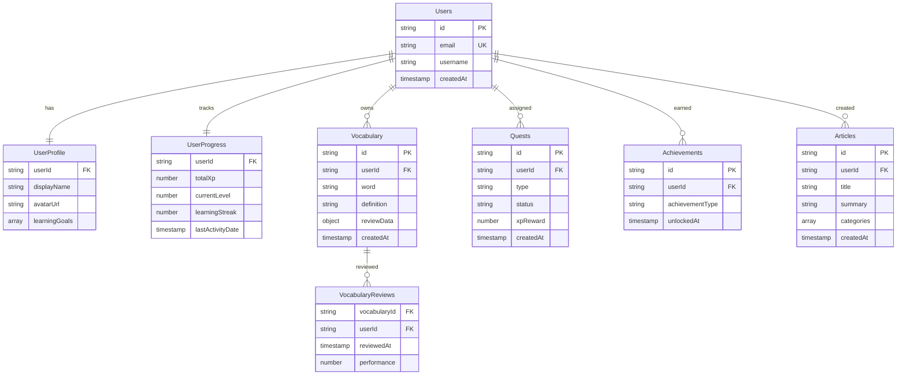

# Database Design - TechLingual Quest

This document provides detailed database schema design, relationships, and optimization strategies for the TechLingual Quest application, covering both the development phase (local SQLite) and future server phase (cloud database).

## Related Documents
- [High-Level Design](../design/HLD.md) - System architecture overview
- [Low-Level Design](../design/LLD.md) - Detailed technical implementation
- [Requirements](../requirements/requirements.md) - System requirements

---

## 1. Database Strategy Overview

### 1.1 Phase-based Database Approach

**Development Phase (Local SQLite):**
- ローカルDBのみでデータを保持・管理
- QRコードや端末間通信でデータ共有
- 迅速なプロトタイピングと開発コスト削減

**Future Phase (Cloud Database):**
- 資金調達後にサーバーDB導入を検討
- スケーラビリティとデータ一元管理
- バックアップ・セキュリティ向上

### 1.2 Database Technology Choices

#### 1.2.1 Development Phase: SQLite (Local)

**Justification:**
- **Zero Infrastructure Cost**: No server or cloud costs
- **Rapid Development**: Simple setup and deployment
- **Offline First**: Always available without internet
- **Data Portability**: Easy to export/import via QR codes
- **Performance**: Fast local queries and operations

**Trade-offs:**
- No real-time sync between devices
- Limited concurrent access (single app instance)
- Manual data sharing required

#### 1.2.2 Future Phase: Firestore (Cloud)

**Justification:**
- **Real-time Sync**: Automatic data synchronization across devices
- **Scalability**: Google-managed scaling and performance optimization
- **Security**: Integrated security rules and user-based access control
- **Analytics**: Built-in user behavior tracking

**Trade-offs:**
- Ongoing operational costs
- Vendor lock-in with Google Cloud Platform
- Internet dependency

---

## 2. Database Schema Design

### 2.1 Development Phase: SQLite Schema

#### 2.1.1 Database Structure

```sql
-- SQLite Schema for TechLingual Quest
PRAGMA foreign_keys = ON;

-- Users table
CREATE TABLE users (
    id TEXT PRIMARY KEY,
    username TEXT NOT NULL UNIQUE,
    email TEXT,
    display_name TEXT,
    avatar_path TEXT,
    level INTEGER DEFAULT 1,
    current_xp INTEGER DEFAULT 0,
    total_xp INTEGER DEFAULT 0,
    learning_streak INTEGER DEFAULT 0,
    native_language TEXT DEFAULT 'ja',
    target_language_level TEXT DEFAULT 'beginner',
    created_at DATETIME DEFAULT CURRENT_TIMESTAMP,
    updated_at DATETIME DEFAULT CURRENT_TIMESTAMP,
    last_login_at DATETIME
);

-- Vocabulary table
CREATE TABLE vocabulary (
    id TEXT PRIMARY KEY,
    user_id TEXT NOT NULL,
    word TEXT NOT NULL,
    definition TEXT NOT NULL,
    example_sentence TEXT,
    pronunciation TEXT,
    category TEXT,
    difficulty_level INTEGER DEFAULT 1,
    mastery_level INTEGER DEFAULT 0,
    review_count INTEGER DEFAULT 0,
    last_reviewed_at DATETIME,
    next_review_at DATETIME,
    created_at DATETIME DEFAULT CURRENT_TIMESTAMP,
    updated_at DATETIME DEFAULT CURRENT_TIMESTAMP,
    FOREIGN KEY (user_id) REFERENCES users(id) ON DELETE CASCADE
);

-- Articles/Summaries table
CREATE TABLE article_summaries (
    id TEXT PRIMARY KEY,
    user_id TEXT NOT NULL,
    title TEXT NOT NULL,
    url TEXT,
    summary TEXT NOT NULL,
    category TEXT,
    tags TEXT, -- JSON array stored as text
    character_count INTEGER,
    is_auto_generated BOOLEAN DEFAULT FALSE,
    source_language TEXT DEFAULT 'en',
    created_at DATETIME DEFAULT CURRENT_TIMESTAMP,
    updated_at DATETIME DEFAULT CURRENT_TIMESTAMP,
    FOREIGN KEY (user_id) REFERENCES users(id) ON DELETE CASCADE
);

-- Quests table
CREATE TABLE quests (
    id TEXT PRIMARY KEY,
    user_id TEXT NOT NULL,
    type TEXT NOT NULL, -- 'read', 'write', 'listen', 'speak'
    title TEXT NOT NULL,
    description TEXT,
    status TEXT DEFAULT 'not_started', -- 'not_started', 'in_progress', 'completed'
    reward_xp INTEGER DEFAULT 0,
    target_count INTEGER,
    current_progress INTEGER DEFAULT 0,
    due_date DATETIME,
    completed_at DATETIME,
    created_at DATETIME DEFAULT CURRENT_TIMESTAMP,
    updated_at DATETIME DEFAULT CURRENT_TIMESTAMP,
    FOREIGN KEY (user_id) REFERENCES users(id) ON DELETE CASCADE
);

-- Vocabulary Reviews table
CREATE TABLE vocabulary_reviews (
    id TEXT PRIMARY KEY,
    vocabulary_id TEXT NOT NULL,
    user_id TEXT NOT NULL,
    reviewed_at DATETIME DEFAULT CURRENT_TIMESTAMP,
    performance_score INTEGER, -- 1-5 scale
    time_taken_seconds INTEGER,
    was_correct BOOLEAN,
    FOREIGN KEY (vocabulary_id) REFERENCES vocabulary(id) ON DELETE CASCADE,
    FOREIGN KEY (user_id) REFERENCES users(id) ON DELETE CASCADE
);

-- Achievements table
CREATE TABLE achievements (
    id TEXT PRIMARY KEY,
    user_id TEXT NOT NULL,
    achievement_type TEXT NOT NULL,
    title TEXT NOT NULL,
    description TEXT,
    unlocked_at DATETIME DEFAULT CURRENT_TIMESTAMP,
    FOREIGN KEY (user_id) REFERENCES users(id) ON DELETE CASCADE
);

-- User preferences table
CREATE TABLE user_preferences (
    user_id TEXT PRIMARY KEY,
    ui_theme TEXT DEFAULT 'light', -- 'light', 'dark', 'auto'
    language TEXT DEFAULT 'ja', -- app interface language
    notifications_enabled BOOLEAN DEFAULT TRUE,
    daily_reminder_time TIME,
    review_notification_enabled BOOLEAN DEFAULT TRUE,
    updated_at DATETIME DEFAULT CURRENT_TIMESTAMP,
    FOREIGN KEY (user_id) REFERENCES users(id) ON DELETE CASCADE
);

-- Indexes for performance
CREATE INDEX idx_vocabulary_user_id ON vocabulary(user_id);
CREATE INDEX idx_vocabulary_category ON vocabulary(category);
CREATE INDEX idx_vocabulary_next_review ON vocabulary(next_review_at);
CREATE INDEX idx_article_summaries_user_id ON article_summaries(user_id);
CREATE INDEX idx_article_summaries_category ON article_summaries(category);
CREATE INDEX idx_quests_user_id ON quests(user_id);
CREATE INDEX idx_quests_status ON quests(status);
CREATE INDEX idx_vocabulary_reviews_vocabulary_id ON vocabulary_reviews(vocabulary_id);
CREATE INDEX idx_vocabulary_reviews_user_id ON vocabulary_reviews(user_id);
```

#### 2.1.2 Data Sharing Schema (QR Code/Device Communication)

```sql
-- Export/Import metadata for data sharing
CREATE TABLE data_exports (
    id TEXT PRIMARY KEY,
    user_id TEXT NOT NULL,
    export_type TEXT NOT NULL, -- 'vocabulary', 'summaries', 'full_backup'
    data_hash TEXT NOT NULL, -- SHA256 hash for integrity
    created_at DATETIME DEFAULT CURRENT_TIMESTAMP,
    exported_count INTEGER DEFAULT 0,
    FOREIGN KEY (user_id) REFERENCES users(id) ON DELETE CASCADE
);

-- Track imported data to avoid duplicates
CREATE TABLE data_imports (
    id TEXT PRIMARY KEY,
    user_id TEXT NOT NULL,
    source_hash TEXT NOT NULL,
    import_type TEXT NOT NULL,
    imported_at DATETIME DEFAULT CURRENT_TIMESTAMP,
    imported_count INTEGER DEFAULT 0,
    FOREIGN KEY (user_id) REFERENCES users(id) ON DELETE CASCADE
);
```

#### 2.1.3 Entity Relationship Diagram (SQLite Schema)


### 2.2 Future Phase: Cloud Database Schema (Firestore)

#### 2.2.1 Collection Structure

```
techlingual-quest/
├── users/
│   ├── {userId}/
│   │   ├── profile/
│   │   ├── progress/
│   │   └── preferences/
├── vocabulary/
│   └── {wordId}/
├── quests/
│   └── {questId}/
├── achievements/
│   └── {achievementId}/
├── articles/
│   └── {articleId}/
└── user-stats/
    └── {userId}/
```

#### 2.2.2 Detailed Schema Definitions

##### 2.2.2.1 Users Collection

```javascript
// /users/{userId}
{
  "id": "string", // Firebase Auth UID
  "email": "string",
  "username": "string",
  "createdAt": "timestamp",
  "lastLogin": "timestamp",
  "isActive": "boolean",
  
  // Subcollections referenced below
  "profile": "subcollection",
  "progress": "subcollection", 
  "preferences": "subcollection"
}

// /users/{userId}/profile/current
{
  "displayName": "string",
  "avatarUrl": "string?",
  "bio": "string?",
  "learningGoals": ["string"], // Array of goal categories
  "nativeLanguage": "string",
  "targetLanguageLevel": "string", // beginner, intermediate, advanced
  "occupation": "string?",
  "timeZone": "string",
  "updatedAt": "timestamp"
}

// /users/{userId}/progress/current
{
  "totalXp": "number",
  "currentLevel": "number",
  "learningStreak": "number",
  "longestStreak": "number",
  "vocabularyCount": "number",
  "vocabularyMastered": "number",
  "questsCompleted": "number",
  "articlesCreated": "number",
  "totalStudyTimeMinutes": "number",
  "lastActivityDate": "timestamp",
  "levelUpDate": "timestamp?",
  "streakStartDate": "timestamp",
  "updatedAt": "timestamp"
}

// /users/{userId}/preferences/current
{
  "notificationsEnabled": "boolean",
  "dailyReminderTime": "string", // HH:mm format
  "weeklyGoalMinutes": "number",
  "preferredQuizTypes": ["string"],
  "spacedRepetitionIntensity": "string", // conservative, normal, aggressive
  "uiTheme": "string", // light, dark, auto
  "language": "string", // app interface language
  "updatedAt": "timestamp"
}
```

#### 2.2.2 Vocabulary Collection

```javascript
// /vocabulary/{wordId}
{
  "id": "string",
  "userId": "string", // Reference to user
  "word": "string",
  "definition": "string",
  "exampleSentence": "string",
  "pronunciation": "string?", // IPA or phonetic
  "categories": ["string"], // programming, networking, etc.
  "tags": ["string"], // user-defined tags
  "difficultyLevel": "number", // 1-5 scale
  "source": "string?", // where the word was found
  "sourceUrl": "string?",
  "isPublic": "boolean", // can be shared with other users
  "createdAt": "timestamp",
  "updatedAt": "timestamp",
  
  // Spaced Repetition Data
  "reviewData": {
    "lastReviewed": "timestamp",
    "reviewCount": "number",
    "retentionScore": "number", // 0.0-1.0
    "nextReviewDate": "timestamp",
    "spacedRepetition": {
      "intervalDays": "number",
      "easinessFactor": "number", // 1.3-2.5
      "repetitionNumber": "number"
    },
    "reviewHistory": [
      {
        "reviewedAt": "timestamp",
        "performance": "number", // 0-3 (failed, hard, good, easy)
        "timeSpentSeconds": "number",
        "wasCorrect": "boolean"
      }
    ]
  },
  
  // Learning Analytics
  "analytics": {
    "firstLearnedDate": "timestamp",
    "lastCorrectAnswer": "timestamp",
    "totalReviewTime": "number", // seconds
    "averageResponseTime": "number", // seconds
    "successRate": "number", // 0.0-1.0
    "mistakeCount": "number",
    "streakCount": "number"
  }
}
```

#### 2.2.3 Quests Collection

```javascript
// /quests/{questId}
{
  "id": "string",
  "userId": "string",
  "type": "string", // vocabularyReview, vocabularyQuiz, articleSummary, etc.
  "title": "string",
  "description": "string",
  "instructions": "string?",
  "status": "string", // available, inProgress, completed, expired, failed
  "priority": "string", // low, normal, high
  "xpReward": "number",
  "streakBonus": "number", // additional XP for streak maintenance
  "timeEstimateMinutes": "number",
  "difficultyLevel": "number", // 1-5
  "createdAt": "timestamp",
  "availableUntil": "timestamp",
  "startedAt": "timestamp?",
  "completedAt": "timestamp?",
  "expiresAt": "timestamp",
  
  // Quest-specific data (varies by type)
  "questData": {
    // For vocabulary quests
    "targetReviewCount": "number?",
    "wordIds": ["string"],
    "questionsGenerated": ["object"],
    
    // For article quests
    "articleId": "string?",
    "targetWordCount": "number?",
    "requiredSections": ["string"],
    
    // For challenge quests
    "challengeType": "string?",
    "targetScore": "number?",
    "timeLimit": "number?" // seconds
  },
  
  // Completion tracking
  "progress": {
    "currentStep": "number",
    "totalSteps": "number",
    "completedSteps": ["string"],
    "stepData": "object", // step-specific progress data
    "lastUpdateAt": "timestamp"
  }
}
```

#### 2.2.4 Achievements Collection

```javascript
// /achievements/{achievementId}
{
  "id": "string",
  "userId": "string",
  "achievementType": "string", // vocabulary, streak, quest, level, special
  "title": "string",
  "description": "string",
  "badgeIconUrl": "string",
  "badgeColor": "string",
  "rarity": "string", // common, rare, epic, legendary
  "category": "string",
  "unlockedAt": "timestamp",
  "progress": "number", // 0.0-1.0 for progressive achievements
  "isVisible": "boolean", // some achievements might be hidden until unlocked
  
  // Achievement-specific data
  "achievementData": {
    "threshold": "number?", // required value to unlock
    "currentValue": "number?", // current progress toward threshold
    "relatedQuests": ["string"], // quest IDs that contributed
    "milestoneValues": ["number"], // for multi-tier achievements
    "specialConditions": "object?" // custom unlock conditions
  },
  
  "metadata": {
    "xpReward": "number",
    "shareableText": "string",
    "celebrationAnimation": "string?",
    "unlockSound": "string?"
  }
}
```

#### 2.2.5 Articles Collection

```javascript
// /articles/{articleId}
{
  "id": "string",
  "userId": "string",
  "title": "string",
  "summary": "string",
  "content": "string", // full article content or summary
  "originalUrl": "string?",
  "source": "string?", // website, book, paper, etc.
  "author": "string?",
  "publishedDate": "timestamp?",
  "createdAt": "timestamp",
  "updatedAt": "timestamp",
  "isPublic": "boolean",
  "isPinned": "boolean",
  
  // Categorization
  "categories": ["string"], // AI, databases, networking, etc.
  "tags": ["string"], // user-defined tags
  "difficultyLevel": "number", // 1-5
  "readingTimeMinutes": "number",
  "wordCount": "number",
  
  // Content analysis
  "extractedVocabulary": [
    {
      "word": "string",
      "context": "string", // sentence where word appears
      "definition": "string?",
      "isAdded": "boolean" // added to user's vocabulary
    }
  ],
  
  "analytics": {
    "viewCount": "number",
    "lastViewed": "timestamp",
    "vocabularyExtracted": "number",
    "timeSpentReading": "number", // seconds
    "isBookmarked": "boolean",
    "rating": "number?" // 1-5 user rating
  },
  
  "exportData": {
    "lastExported": "timestamp?",
    "exportFormat": "string?", // pdf, markdown, etc.
    "externalAccessToken": "string?" // for API access
  }
}
```

---

## 3. Database Indexes and Query Optimization

### 3.1 Required Firestore Indexes

```javascript
// Composite indexes for efficient queries
const indexes = [
  // Vocabulary queries
  {
    collection: "vocabulary",
    fields: [
      { field: "userId", order: "ASCENDING" },
      { field: "reviewData.nextReviewDate", order: "ASCENDING" }
    ]
  },
  {
    collection: "vocabulary", 
    fields: [
      { field: "userId", order: "ASCENDING" },
      { field: "categories", order: "ASCENDING" },
      { field: "createdAt", order: "DESCENDING" }
    ]
  },
  {
    collection: "vocabulary",
    fields: [
      { field: "userId", order: "ASCENDING" },
      { field: "reviewData.retentionScore", order: "ASCENDING" }
    ]
  },
  
  // Quest queries
  {
    collection: "quests",
    fields: [
      { field: "userId", order: "ASCENDING" },
      { field: "status", order: "ASCENDING" },
      { field: "createdAt", order: "DESCENDING" }
    ]
  },
  {
    collection: "quests",
    fields: [
      { field: "userId", order: "ASCENDING" },
      { field: "type", order: "ASCENDING" },
      { field: "availableUntil", order: "ASCENDING" }
    ]
  },
  
  // Article queries
  {
    collection: "articles",
    fields: [
      { field: "userId", order: "ASCENDING" },
      { field: "categories", order: "ASCENDING" },
      { field: "updatedAt", order: "DESCENDING" }
    ]
  },
  {
    collection: "articles",
    fields: [
      { field: "userId", order: "ASCENDING" },
      { field: "isPinned", order: "DESCENDING" },
      { field: "updatedAt", order: "DESCENDING" }
    ]
  },
  
  // Achievement queries
  {
    collection: "achievements",
    fields: [
      { field: "userId", order: "ASCENDING" },
      { field: "achievementType", order: "ASCENDING" },
      { field: "unlockedAt", order: "DESCENDING" }
    ]
  }
];
```

### 3.2 Query Patterns and Optimization

#### 3.2.1 Vocabulary Review Queries

```javascript
// Get words due for review
const getWordsForReview = (userId) => {
  return firestore
    .collection('vocabulary')
    .where('userId', '==', userId)
    .where('reviewData.nextReviewDate', '<=', new Date())
    .orderBy('reviewData.nextReviewDate')
    .limit(20); // Pagination for large vocabulary sets
};

// Get words by difficulty for adaptive learning
const getWordsByDifficulty = (userId, maxDifficulty) => {
  return firestore
    .collection('vocabulary')
    .where('userId', '==', userId)
    .where('difficultyLevel', '<=', maxDifficulty)
    .where('reviewData.retentionScore', '<', 0.8)
    .orderBy('reviewData.retentionScore')
    .limit(10);
};
```

#### 3.2.2 Quest Management Queries

```javascript
// Get available quests for user
const getAvailableQuests = (userId) => {
  return firestore
    .collection('quests')
    .where('userId', '==', userId)
    .where('status', '==', 'available')
    .where('availableUntil', '>', new Date())
    .orderBy('availableUntil')
    .orderBy('priority', 'desc');
};

// Get quest completion history
const getQuestHistory = (userId, limit = 20) => {
  return firestore
    .collection('quests')
    .where('userId', '==', userId)
    .where('status', '==', 'completed')
    .orderBy('completedAt', 'desc')
    .limit(limit);
};
```

---

## 4. Data Relationships and Integrity

### 4.1 Relationship Diagram



### 4.2 Data Integrity Rules

#### 4.2.1 Firestore Security Rules

```javascript
rules_version = '2';
service cloud.firestore {
  match /databases/{database}/documents {
    // Users can only access their own data
    match /users/{userId} {
      allow read, write: if request.auth != null && request.auth.uid == userId;
      
      // Subcollections inherit parent permissions
      match /{document=**} {
        allow read, write: if request.auth != null && request.auth.uid == userId;
      }
    }
    
    // Vocabulary access control
    match /vocabulary/{wordId} {
      allow read, write: if request.auth != null 
        && request.auth.uid == resource.data.userId;
      allow create: if request.auth != null 
        && request.auth.uid == request.resource.data.userId;
    }
    
    // Quests - users can read/update their own quests
    match /quests/{questId} {
      allow read: if request.auth != null 
        && request.auth.uid == resource.data.userId;
      allow update: if request.auth != null 
        && request.auth.uid == resource.data.userId
        && request.resource.data.userId == resource.data.userId; // Prevent userId changes
    }
    
    // Achievements - read only for users, created by cloud functions
    match /achievements/{achievementId} {
      allow read: if request.auth != null 
        && request.auth.uid == resource.data.userId;
      allow write: if false; // Only cloud functions can write
    }
    
    // Articles - users can manage their own, read public ones
    match /articles/{articleId} {
      allow read: if request.auth != null && (
        request.auth.uid == resource.data.userId ||
        resource.data.isPublic == true
      );
      allow write: if request.auth != null 
        && request.auth.uid == resource.data.userId;
    }
  }
}
```

#### 4.2.2 Data Validation Rules

```javascript
// Validation functions (implemented in client and cloud functions)
const validateVocabularyWord = (word) => {
  const errors = [];
  
  if (!word.word || word.word.trim().length === 0) {
    errors.push('Word is required');
  }
  
  if (!word.definition || word.definition.trim().length === 0) {
    errors.push('Definition is required');
  }
  
  if (word.difficultyLevel < 1 || word.difficultyLevel > 5) {
    errors.push('Difficulty level must be between 1 and 5');
  }
  
  if (word.reviewData.retentionScore < 0 || word.reviewData.retentionScore > 1) {
    errors.push('Retention score must be between 0 and 1');
  }
  
  return errors;
};

const validateQuest = (quest) => {
  const errors = [];
  
  if (!quest.type || !['vocabularyReview', 'vocabularyQuiz', 'articleSummary'].includes(quest.type)) {
    errors.push('Invalid quest type');
  }
  
  if (quest.xpReward < 0 || quest.xpReward > 1000) {
    errors.push('XP reward must be between 0 and 1000');
  }
  
  if (quest.expiresAt <= quest.createdAt) {
    errors.push('Expiration date must be after creation date');
  }
  
  return errors;
};
```

---

## 5. Performance Optimization

### 5.1 Caching Strategy

```javascript
// Client-side caching with offline support
const CacheConfig = {
  // Cache user profile for 1 hour
  userProfile: { 
    ttl: 3600000, // 1 hour in milliseconds
    storage: 'memory'
  },
  
  // Cache vocabulary words for 30 minutes
  vocabularyWords: {
    ttl: 1800000, // 30 minutes
    storage: 'persistent'
  },
  
  // Cache quest data for 10 minutes
  questData: {
    ttl: 600000, // 10 minutes
    storage: 'memory'
  },
  
  // Cache analytics data for 5 minutes
  analyticsData: {
    ttl: 300000, // 5 minutes
    storage: 'memory'
  }
};

// Implement cache-first strategy for vocabulary reviews
const getCachedVocabularyWords = async (userId) => {
  const cacheKey = `vocabulary_${userId}`;
  const cached = await Cache.get(cacheKey);
  
  if (cached && !Cache.isExpired(cacheKey)) {
    return cached;
  }
  
  const fresh = await firestore
    .collection('vocabulary')
    .where('userId', '==', userId)
    .get();
    
  await Cache.set(cacheKey, fresh.docs.map(doc => doc.data()));
  return fresh.docs.map(doc => doc.data());
};
```

### 5.2 Pagination and Lazy Loading

```javascript
// Implement cursor-based pagination for large datasets
class VocabularyPaginator {
  constructor(userId, pageSize = 20) {
    this.userId = userId;
    this.pageSize = pageSize;
    this.lastDocument = null;
  }
  
  async getNextPage() {
    let query = firestore
      .collection('vocabulary')
      .where('userId', '==', this.userId)
      .orderBy('createdAt', 'desc')
      .limit(this.pageSize);
    
    if (this.lastDocument) {
      query = query.startAfter(this.lastDocument);
    }
    
    const snapshot = await query.get();
    const documents = snapshot.docs.map(doc => ({ id: doc.id, ...doc.data() }));
    
    this.lastDocument = snapshot.docs[snapshot.docs.length - 1];
    
    return {
      documents,
      hasMore: documents.length === this.pageSize
    };
  }
}
```

### 5.3 Background Data Synchronization

```javascript
// Cloud function for periodic data cleanup and optimization
exports.optimizeUserData = functions.pubsub
  .schedule('every 24 hours')
  .onRun(async (context) => {
    const batch = firestore.batch();
    
    // Clean up expired quests
    const expiredQuests = await firestore
      .collection('quests')
      .where('expiresAt', '<', new Date())
      .where('status', 'in', ['available', 'inProgress'])
      .get();
    
    expiredQuests.docs.forEach(doc => {
      batch.update(doc.ref, { status: 'expired' });
    });
    
    // Update user streaks
    const users = await firestore.collection('users').get();
    
    for (const userDoc of users.docs) {
      const userId = userDoc.id;
      const progressDoc = await firestore
        .doc(`users/${userId}/progress/current`)
        .get();
      
      if (progressDoc.exists) {
        const progress = progressDoc.data();
        const daysSinceLastActivity = Math.floor(
          (Date.now() - progress.lastActivityDate.toMillis()) / (1000 * 60 * 60 * 24)
        );
        
        if (daysSinceLastActivity > 1) {
          // Reset streak if more than 1 day inactive
          batch.update(progressDoc.ref, {
            learningStreak: 0,
            streakStartDate: null
          });
        }
      }
    }
    
    await batch.commit();
    console.log('Data optimization completed');
  });
```

---

## 6. Backup and Disaster Recovery

### 6.1 Automated Backup Strategy

```javascript
// Cloud function for automated backups
exports.createDailyBackup = functions.pubsub
  .schedule('every day 02:00')
  .timeZone('UTC')
  .onRun(async (context) => {
    const admin = require('firebase-admin');
    const client = new admin.firestore.v1.FirestoreAdminClient();
    
    const projectId = process.env.GCP_PROJECT || process.env.GCLOUD_PROJECT;
    const databaseName = client.databasePath(projectId, '(default)');
    
    const timestamp = new Date().toISOString().split('T')[0];
    const bucket = `gs://${projectId}-backups`;
    const fileName = `firestore-backup-${timestamp}`;
    
    try {
      const [operation] = await client.exportDocuments({
        name: databaseName,
        outputUriPrefix: `${bucket}/${fileName}`,
        collectionIds: [] // Empty array exports all collections
      });
      
      console.log(`Backup operation started: ${operation.name}`);
      return operation;
    } catch (error) {
      console.error('Backup failed:', error);
      throw error;
    }
  });
```

### 6.2 Data Recovery Procedures

```javascript
// Recovery function for restoring from backup
exports.restoreFromBackup = functions.https.onCall(async (data, context) => {
  // Verify admin privileges
  if (!context.auth || !context.auth.token.admin) {
    throw new functions.https.HttpsError(
      'permission-denied',
      'Must be an admin to restore data'
    );
  }
  
  const admin = require('firebase-admin');
  const client = new admin.firestore.v1.FirestoreAdminClient();
  
  const projectId = process.env.GCP_PROJECT;
  const databaseName = client.databasePath(projectId, '(default)');
  const backupPath = data.backupPath;
  
  try {
    const [operation] = await client.importDocuments({
      name: databaseName,
      inputUriPrefix: backupPath,
      collectionIds: data.collections || [] // Specify collections to restore
    });
    
    console.log(`Restore operation started: ${operation.name}`);
    return { operationName: operation.name };
  } catch (error) {
    console.error('Restore failed:', error);
    throw new functions.https.HttpsError('internal', 'Restore operation failed');
  }
});
```

---

## 3. Migration Strategy: SQLite to Cloud Database

### 3.1 Data Migration Process


### 3.2 Migration Steps

#### 3.2.1 Pre-Migration
1. **Data Audit**: Analyze SQLite data for consistency and completeness
2. **Schema Mapping**: Map SQLite tables to Firestore collections
3. **Migration Tool Development**: Create automated migration scripts
4. **Testing Environment Setup**: Prepare staging environment for testing

#### 3.2.2 Migration Execution
1. **Data Export**: Export user data from SQLite to JSON format
2. **Data Transformation**: Convert SQL data to NoSQL document structure
3. **Incremental Import**: Import data in batches to Firestore
4. **Data Validation**: Verify data integrity and completeness

#### 3.2.3 Post-Migration
1. **User Account Linking**: Link Firebase Auth to migrated user data
2. **Application Updates**: Deploy cloud-enabled app version
3. **Monitoring**: Monitor system performance and user experience
4. **Gradual Rollout**: Phased rollout to user segments

### 3.3 Data Sharing Flow (Development Phase)


### 3.4 Schema Compatibility Considerations

#### 3.4.1 Data Type Mapping

| SQLite Type | Firestore Type | Notes |
|-------------|----------------|-------|
| TEXT | string | Direct mapping |
| INTEGER | number | Direct mapping |
| DATETIME | timestamp | Convert to Firestore timestamp |
| BOOLEAN | boolean | Direct mapping |
| JSON TEXT | object/array | Parse JSON to native Firestore types |

#### 3.4.2 Relationship Mapping

| SQLite Approach | Firestore Approach | Migration Strategy |
|-----------------|--------------------|--------------------|
| Foreign Keys | Document References | Convert foreign keys to document references |
| JOIN queries | Denormalization | Restructure data for NoSQL optimization |
| Transactions | Batch Operations | Convert transactions to Firestore batch operations |

---

## Version History

| Version | Date | Author | Changes |
|---------|------|--------|---------|
| 1.0 | 2025-08-29 | GitHub Copilot Agent | Initial database design documentation |
| 2.0 | 2025-08-29 | GitHub Copilot Agent | Added SQLite schema, ER diagram, migration strategy |