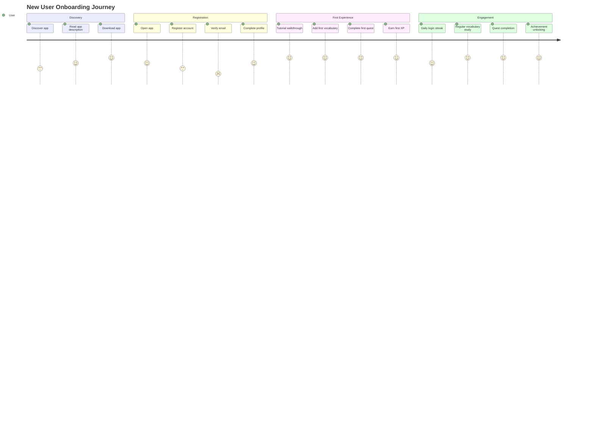
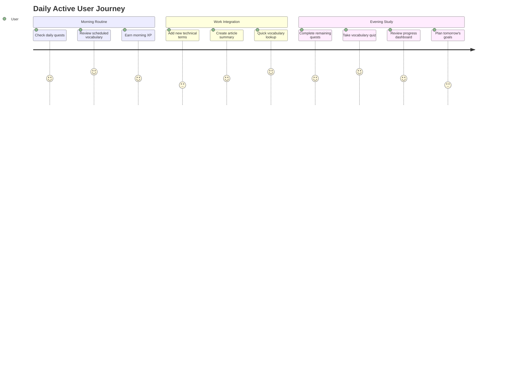

# User Requirements - TechLingual Quest

This document captures user stories and functional requirements from the end-user perspective, complementing the system requirements for comprehensive requirement coverage.

## Related Documents
- [System Requirements](system-requirements.md) - Technical system requirements
- [High-Level Design](../design/HLD.md) - System architecture overview
- [Development Tasks](../docs/development-tasks.md) - Implementation task breakdown

---

## 1. User Personas

### 1.1 Primary Persona: Technical Professional
**Name:** Alex Chen  
**Role:** Software Developer  
**Goals:** Improve technical English for international collaboration  
**Pain Points:** Limited time for structured learning, difficulty retaining technical vocabulary  
**Technology:** Primarily mobile device user, moderate gaming experience

### 1.2 Secondary Persona: Graduate Student
**Name:** Yuki Tanaka  
**Role:** Computer Science Graduate Student  
**Goals:** Enhance technical English for research papers and presentations  
**Pain Points:** Overwhelmed by technical terminology, needs structured learning approach  
**Technology:** Mix of mobile and desktop usage, enjoys achievement-based systems

---

## 2. User Stories

### 2.1 Authentication & Profile Management

**US-001**: As a new user, I want to register with my email and password so that I can create a personal learning account.
- **Acceptance Criteria:**
  - Registration form accepts valid email and secure password
  - Email verification process (optional for MVP)
  - Profile creation with basic information
  - Automatic login after successful registration

**US-002**: As a returning user, I want to log into my account so that I can access my learning progress and data.
- **Acceptance Criteria:**
  - Login form with email/password validation
  - Remember me functionality
  - Password reset option available
  - Seamless navigation to dashboard after login

**US-003**: As a user, I want to manage my profile settings so that I can customize my learning experience.
- **Acceptance Criteria:**
  - Profile editing interface
  - Learning preferences configuration
  - Notification settings management
  - Account deletion option

### 2.2 Vocabulary Learning

**US-004**: As a learner, I want to add new vocabulary words so that I can build my technical English vocabulary.
- **Acceptance Criteria:**
  - Word entry form with definition, example, and context
  - Auto-suggestion from existing database
  - Category/tag assignment for organization
  - Immediate addition to personal vocabulary list

**US-005**: As a learner, I want to study vocabulary using flashcards so that I can memorize and retain new words effectively.
- **Acceptance Criteria:**
  - Card-style interface showing word and definition
  - Flip animation to reveal answer
  - Difficulty rating system (easy/medium/hard)
  - Progress tracking for each word

**US-006**: As a learner, I want to take vocabulary quizzes so that I can test my knowledge and retention.
- **Acceptance Criteria:**
  - Multiple choice, fill-in-blank, and matching question types
  - Adaptive difficulty based on previous performance
  - Immediate feedback with explanations
  - Quiz results and analytics

**US-007**: As a learner, I want the system to remind me to review vocabulary so that I can maintain long-term retention.
- **Acceptance Criteria:**
  - Spaced repetition algorithm implementation
  - Smart scheduling based on forgetting curve
  - Push notifications for review sessions
  - Review session availability tracking

### 2.3 Quest & Gamification

**US-008**: As a learner, I want to earn XP and level up so that I feel motivated to continue learning.
- **Acceptance Criteria:**
  - XP awarded for completed activities
  - Visual level progression with meaningful milestones
  - XP breakdown showing sources (vocabulary, quests, etc.)
  - Level-based unlockable content or features

**US-009**: As a learner, I want to complete daily and weekly quests so that I have structured learning goals.
- **Acceptance Criteria:**
  - Variety of quest types: vocabulary, reading, writing, listening
  - Clear quest objectives and progress indicators
  - Automatic quest generation based on learning patterns
  - Bonus rewards for quest completion streaks

**US-010**: As a learner, I want to earn achievement badges so that I can track my learning milestones.
- **Acceptance Criteria:**
  - Achievement categories: vocabulary, streaks, quests, milestones
  - Visual badge collection interface
  - Social sharing capabilities for achievements
  - Progressive achievement unlocking system

### 2.4 Article Summary System

**US-011**: As a professional, I want to store summaries of technical articles so that I can reference them later for work.
- **Acceptance Criteria:**
  - Article summary creation interface
  - Rich text formatting with code snippets support
  - Tagging and categorization system
  - Search functionality across summaries

**US-012**: As a professional, I want to access my article summaries from outside the app so that I can use them during work.
- **Acceptance Criteria:**
  - Web interface for summary access
  - Export functionality (PDF, markdown)
  - API access for external tools
  - Cross-platform synchronization

**US-013**: As a learner, I want to extract vocabulary from articles so that I can learn technical terms in context.
- **Acceptance Criteria:**
  - Vocabulary extraction from article text
  - Context preservation with original sentences
  - Automatic addition to personal vocabulary
  - Difficulty estimation based on usage frequency

### 2.5 Progress Tracking & Analytics

**US-014**: As a learner, I want to see my learning progress so that I can understand my improvement over time.
- **Acceptance Criteria:**
  - Comprehensive dashboard with multiple metrics
  - Visual graphs for vocabulary learned, XP gained, time spent
  - Progress comparison with previous periods
  - Goal setting and tracking interface

**US-015**: As a learner, I want to analyze my learning patterns so that I can optimize my study schedule.
- **Acceptance Criteria:**
  - Learning session analytics (time, efficiency, retention)
  - Weak area identification and recommendations
  - Optimal study time suggestions
  - Performance prediction modeling

### 2.6 External Integration

**US-016**: As a learner, I want to practice conversations using GPT so that I can apply my technical vocabulary in realistic scenarios.
- **Acceptance Criteria:**
  - Seamless linking to GPT official app
  - Context sharing for vocabulary-focused conversations
  - Return integration with learning progress updates
  - Conversation topic suggestions based on recent vocabulary

**US-017**: As a user, I want AI assistance for quiz generation so that I have varied and challenging practice materials.
- **Acceptance Criteria:**
  - AI-generated questions based on personal vocabulary
  - Multiple difficulty levels and question types
  - Content quality validation and filtering
  - Usage optimization for API cost management

---

## 3. User Journey Maps

### 3.1 New User Onboarding Journey

### 3.2 Daily Usage Journey

---

## 4. Acceptance Criteria Summary

### 4.1 User Experience Criteria
- Onboarding completion rate > 80%
- User retention rate > 60% after first week
- Daily active usage > 15 minutes for engaged users
- Feature discovery rate > 70% within first month

### 4.2 Learning Effectiveness Criteria
- Vocabulary retention improvement measurable through testing
- Quest completion rate > 70% for active users
- User-reported learning confidence increase > 50%
- Time-to-competency reduction demonstrated through usage analytics

### 4.3 Engagement Criteria
- Daily login streak achievement > 7 days for 40% of users
- Achievement unlocking frequency > 2 per week for active users
- User-generated content (summaries, custom vocabulary) > 70% of users
- External integration usage > 30% of users

---

## 5. User Feedback Integration

### 5.1 Feedback Collection Methods
- In-app rating prompts after key milestones
- Periodic survey deployment for feature satisfaction
- User interview sessions for qualitative insights
- Usage analytics for behavioral pattern analysis

### 5.2 Continuous Improvement Process
- Monthly user feedback review and prioritization
- A/B testing for feature optimization
- Regular usability testing sessions
- Feature usage analytics and optimization

---

## Version History

| Version | Date | Author | Changes |
|---------|------|--------|---------|
| 1.0 | 2025-08-29 | GitHub Copilot Agent | Initial user requirements documentation |